```{r}
library(tidyverse)
```

# Sitzung 1: Einführung & Organisatorisches

## Ziele dieser Veranstaltung

- Werkzeuge für Datenanalyse in der Bachelor-Arbeit
- Grundkenntnisse Statistik, nicht nur für die Uni

## Was Sie erwartet

- Grundlegende Konzepte der Statistik
- Einführung in R und RStudio
- Datenimport und -aufbereitung
- Explorative Datenanalyse
- Datenvisualisierung
- Lineare Regression
- Hypothesentests
- Korrelationen

## Übersicht der Sitzungen (1/2)

| Sitzung | Thema                                           |
|---------|-------------------------------------------------|
| 1       | Einführung & Organisatorisches                  |
| 2       | Einführung in R                                 |
| 3       | Deskriptive Statistik I – Lage- & Streuungsmaße |
| 4       | Deskriptive Statistik II & Datenmanipulation    |
| 5       | Datenvisualisierung                             |
| 6       | Wahrscheinlichkeiten & Verteilungen             |
| 7       | Inferenzstatistik & t-Test                      |

## Übersicht der Sitzungen (2/2)

| Sitzung | Thema                                  |
|---------|----------------------------------------|
| 8       | Chi-Quadrat-Test                       |
| 9       | Korrelationsanalyse                    |
| 10      | Regression I – Lineare Regression      |
| 11      | ANOVA                                  |
| 12      | Text Mining & Klassifikation           |
| 13      | Regression II – Logistische Regression |
| 14      | Abschluss                              |

## Erwartungen und Interaktion

- **Slido:** Interaktive Beteiligung über [Slido](https://app.sli.do)
  - 16 Uhr: #68430031
  - 18 Uhr: #68430032

## Rules of Working

- **Fragen:** Bitte unterbrechen Sie mich für Fragen
- **Kontakt:** [tom\@alby.de](mailto:tom@alby.de)
- **Sprechstunde:** <https://alby.link/talk2me>
- **Moodle:** Einschreibeschlüssel: iLoveStats!
- **Teilnahme:** Keine Anwesenheitspflicht, keine Präsenzpflicht, Online-Teilnahme via Teams möglich
- Gruppen können online jederzeit gewechselt werden
- Sessions als KI-Podcast?

## Prüfungsleistung

- Referat (mit Befragung, nicht online)
- Keine Gruppenarbeit
- Bitte Datensatz und Fragestellung selbst aussuchen und kurz absprechen
- Beispiel: Hängen Bildschirmzeit und Depressionsanfälligkeit zusammen?
- Präsentation mit Quellenangaben sowie Code nach Referat in Moodle hochladen
- Termine für Referate (nach 8. Sitzung) bitte ins Forum posten

## Software

- R <https://r-project.org>
- RStudio <https://posit.co/download/rstudio-desktop>
- Alternative: posit.cloud

## Literatur

- Wollschläger, D. (2020) Grundlagen der Datenanalyse mit R: Eine anwendungsorientierte Einführung. 5. Aufl. Berlin/Heidelberg: Springer Spektrum. doi: 10.1007/978-3-662-61736-6.
- Ist bereits im Moodle :)

## Warum nutzen wir R?

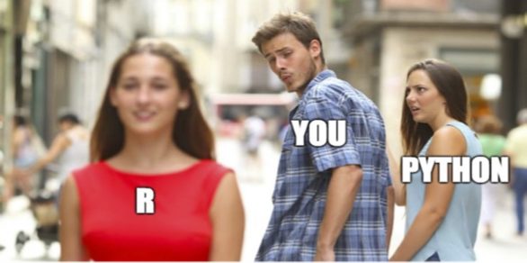

## Letzte Fragen?

## Unterstützung für Studierende

- Studentische Seelsorge, rund um die Uhr: 040 41170411
- [Studierendenberatung\@haw-hamburg.de](mailto:Studierendenberatung@haw-hamburg.de)
- [krisenteam\@haw-hamburg.de](mailto:krisenteam@haw-hamburg.de)
- Psychologische Sprechzeit ohne Anmeldung (Dienstags 14-15 Uhr): +49 152 247 44 063
- Weitere Infos: [HAW Beratung](https://www.haw-hamburg.de/beratung/)

## Let's start!


## Der Forschungsprozess

| Schritt | Frage | Beispiel |
|------------------------|------------------------|------------------------|
| **1. Fragestellung** | Was will ich wissen? | Beeinflusst Schlafmangel die Prüfungsleistung? |
| **2. Theorie & Hypothese** | Was erwarte ich? | Weniger Schlaf → schlechtere Noten |
| **3. Datenerhebung** | Wie messe ich es? | Befragung von 80 Studierenden |
| **4. Datenaufbereitung** | Sind die Daten sauber? | Fehlende Werte, Ausreißer prüfen |
| **5. Analyse** | Was zeigen die Daten? | Korrelation, Regression |
| **6. Interpretation** | Was bedeutet das? | Effektgröße, Einschränkungen |
| **7. Kommunikation** | Wie berichte ich es? | Bachelorarbeit, Referat |

## Wo hilft Ihnen dieser Kurs?

| Schritt | Inhalt des Kurses |
|------------------------------------|------------------------------------|
| Datenaufbereitung | Sitzung 4 – Datenmanipulation mit R |
| Analyse: beschreiben | Sitzungen 3–5 – Deskriptive Statistik & Visualisierung |
| Analyse: testen | Sitzungen 7–13 – Inferenzstatistik, Tests, Regression |
| Interpretation | Durchgehend: Effektgrößen, Voraussetzungen, Fehler |
| Kommunikation | Sitzung 14 – Ergebnisse korrekt berichten |

## Was sind Daten und Informationen?

## Was sind Daten und Informationen?

- *Daten*
  - Roh, ungeordnet, noch nicht interpretiert
  - Bestehen aus Zahlen, Zeichen, Fakten ohne Kontext
- *Informationen*
  - Verarbeitete, kontextualisierte Daten
  - Haben Bedeutung und Relevanz für eine Fragestellung
  - **Daten + Kontext = Information**

## DIKW-Pyramide


## Toms Pyramide


## Daten oder Informationen?

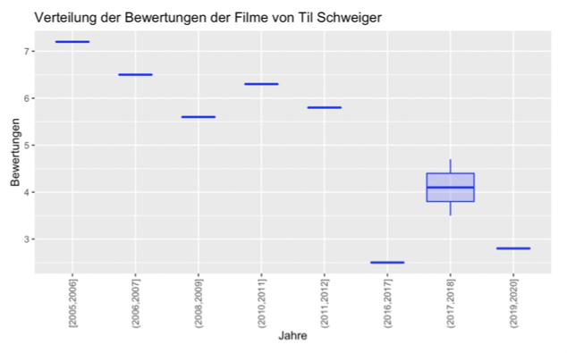

## Skalenniveau

| Statistische Einheit / Merkmalsträger | Merkmal | Ausprägung | Typ / Skala | Erläuterung |
|---------------|---------------|---------------|---------------|---------------|
| n1 | Haarfarbe | Rot | Kategorial / nominalskaliert | Keine Abstände |
| n1 | Postleitzahl | 22703 | Numerisch / nominalskaliert | Keine Abstände |
| n1 | Schulabschluss | Abitur | Kategorial / ordinalskaliert | willkürliche Abstände |
| Sport-Team A | Tabellenplatz | 7 | Numerisch / ordinalskaliert | willkürliche Abstände |
| n1 | Körpertemperatur | 36,5°C. | Numerisch / intervallskaliert / kardinalskaliert | kein Nullpunkt |
| n1 | Alter | 22 | Numerisch / verhältnisskal. / kardinalskaliert | keine Negativwerte |

## Skalenniveau am Beispiel

| title | year | budget | avg_vote |
|------------------|------------------|------------------|------------------|
| Miss Jerry | 1894 | NA | 5.9 |
| The Story of the Kelly Gang | 1906 | \$ 2250 | 6.1 |
| Den sorte drøm | 1911 | NA | 5.8 |
| Cleopatra | 1912 | \$ 45000 | 5.2 |
| L'Inferno | 1911 | NA | 7.0 |
| From the Manger to the Cross; or, Jesus of Nazareth | 1912 | NA | 5.7 |
| Madame DuBarry | 1919 | NA | 6.8 |
| Quo Vadis? | 1913 | ITL 45000 | 6.2 |
| Independenta Romaniei | 1912 | ROL 400000 | 6.7 |
| Richard III | 1912 | \$ 30000 | 5.5 |

## Analytische Konzepte

| Phase & Leitfrage | Statistisches Äquivalent | Beispiel‑Methoden / Tools |
|------------------------|------------------------|------------------------|
| **Rückblick – Was ist passiert?** | **Deskriptive Statistik** | Lage‑ & Streuungsmaße, Häufigkeiten, Balken‑/Liniendiagramme |
| **Erkenntnis – Warum passiert es?** | **Explorative & inferenzielle Statistik** | Korrelation, t‑Test, ANOVA, χ²‑Test, Konfidenz­intervalle, Regressionsdiagnostik |
| **Vorausschau – Was wird passieren?** | **Prognostische (inferenzielle) Modelle** | Lineare/Logistische Regression, Random Forest, Zeitreihen‑Forecasts, Konfidenz­intervalle für Prognosen |
| **Vorausschau – Was muss passieren, damit es eintritt?** | **Präskriptive (inferenzielle) Verfahren** | Simulation (Monte‑Carlo), Lineare/Ganzzahl‑Optimierung, Entscheidungsbäume mit Unsicherheits‑Berücksichtigung |

## Aufgabe zur nächsten Sitzung

- R/RStudio installieren oder
- bei Posit Cloud anmelden

# Sitzung 2: Einführung in R

## Lernziele dieser Sitzung

- R und RStudio bedienen
- Grundlegende Datentypen und -strukturen in R kennen
- Ein R Notebook anlegen und ausführen

## Welche Programmiersprachen kennen Sie bereits?

## R, Python, SPSS, ...

- SPSS
- SAS
- Python
- Scala
- Julia
- PSPP
- R

## Die Programmiersprache R

- R: Statistische Programmiersprache und Umgebung
- Nachfolger von S (Unnützes Wissen, Teil 1)
- Großer Vorteil: R ist von Statistikern für Statistiker
- Großer Nachteil: R ist von Statistikern für Statistiker
- Open Source
- Packages (Libraries) erweitern den Umfang

## Die IDE RStudio

- "Wenn R ein Pferd ist, dann ist RStudio der Sattel."
- Entwickelt von RStudio PBC, heute Posit PBC
- Kostenlos für den Heimgebrauch

## Walkthrough: Die Arbeitsumgebung

- Sozusagen der „Arbeitsspeicher“
- Enthält nicht nur Objekte, sondern auch Packages
- Häufige Fehlerursache: -- Man geht davon aus, dass etwas geladen ist, ist es aber nicht. -- Man geht davon aus, dass etwas nicht geladen ist, ist es aber.
- R lädt alles (!) in den Arbeitsspeicher.

## R Notebooks

- Kombiniert Text, Code und Ergebnisse in einem Dokument
- Basieren auf R Markdown; Dateiendung: `.Rmd`
- Ausgabe als HTML direkt in RStudio – kein separater Render-Schritt nötig
- **Vorteil**: Code, Output und Text in einem Dokument – ideal für Analysen in der Bachelorarbeit
- **Referate werden mit einem Notebook gehalten**

## Aufbau eines R Notebooks

- **YAML-Header**: Metadaten (Titel, Format, Autor)
- **Text**: Markdown-Formatierung
- **Code-Chunks**: R-Code, der ausgeführt und angezeigt wird

## R Notebook in der Praxis

- Neues Notebook: File → New File → R Notebook
- Code-Chunk einfügen: Strg+Alt+I (Mac: Cmd+Option+I)
- Ausführen: Chunk per Play-Button oder Strg+Shift+Enter; Gesamtes Notebook: „Preview“
- **Empfehlung**: Schreiben Sie Ihre Analysen immer im Notebook – nie nur in der Konsole

## Die ersten Schritte mit R

- R als Taschenrechner
- Objekt- und Funktionsstruktur in R
- Zuordnung über `<-`
- Hilfe über `?FUNKTIONSNAME`

## Funktionen

- Funktionsstruktur: `funktionsname(Parameter)`
- Beispiele: `plot()`, `summary()`, `str()`

## Datentypen in R

- Character
- Numerisch: integer und double
- Factor
- Datum
- Dynamic typing und Bedeutung korrekter Datentypen

## Datenstrukturen in R

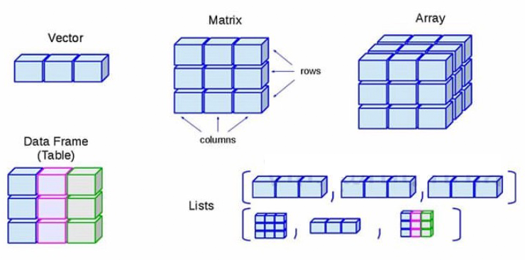

## Datenstrukturen in R

- Vektor: Liste mit gleichen Datentypen
- Dataframe: Tabelle mit Vektoren als Spalten
- Liste: verschiedene Datentypen
- Matrix: Tabelle nur mit gleichen Datentypen
- Array: Dreidimensionale Matrix

## Dataframes

- Zentrales Konzept in R
- Struktur: Zeilen für Observationen, Spalten für Attribute
- Zugriff auf Spalten über Dollarzeichen (`$`)

## Hausaufgabe

- Starten Sie ein Notebook wie oben beschrieben; Sie werden die Aufforderung erhalten, mehrere Packages zu installieren, was Sie bitte tun.
- Installieren Sie das Tidyverse (siehe nächste Folie)
- Laden Sie die Daten unter https://alby.link/books herunter auf Ihre Festplatte

## Packages installieren und laden

- Packages als Erweiterungen zu base R
- Installation einmalig: Tools → Install Packages oder `install.packages("name")`
- Laden in jeder Sitzung: `library(name)`
- Wichtig: Installation ≠ Laden – beides ist notwendig

## Das Tidyverse

- Sammlung von Packages für konsistente Datenanalyse
- Entwickelt von Hadley Wickham (heute bei Posit)
- Kernidee: „Code the way you think"
- Wichtigste Packages: `dplyr`, `ggplot2`, `readr`, `tidyr`, `stringr`

``` r
install.packages("tidyverse")  # einmalig installieren
library(tidyverse)              # jede Sitzung laden
```

# Sitzung 3: Datentransformation I

## Logistik

- Wer ist nächste Woche überhaupt hier?
- Referatstermine
- Datensatz

## Lernziele dieser Sitzung

- Datensätze importieren und in R einlesen
- Das Tidyverse laden und die Pipe-Syntax verstehen
- Einen ersten Datensatz explorieren

## Daten lesen und schreiben

- Dateiformate: CSV, JSON, ARFF, Excel, Parquet, u.a.
- Was sind die Vor- und Nachteile der Formate?
- Import-Beispiele

## Pro-Tipp

- Importzeile aus Code Preview kopieren und ins Notebook kopieren
- library ignorieren (haben wir schon mit dem Tidyverse importiert)
- View(gadata) ignorieren (nervt nur)

## Rohdaten transformieren und zusammenfassen

Beschreiben Sie die Schritte, um eine Tüte Gummibärchen nach Farben zu sortieren

## Rohdaten transformieren und zusammenfassen

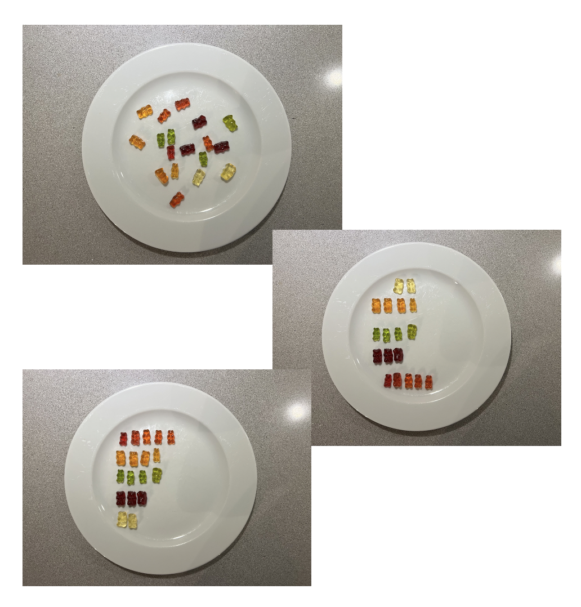

- Öffne die Gummibärchentüte
- Gruppiere die Gummibärchen nach Farbe
- Zähle die Gummibärchen pro Farbe durch
- Zugabe: Sortiere absteigend nach Häufigkeit

## Rohdaten transformieren und zusammenfassen

``` r
Gummibärchentüte %>%
  group_by(farbe) %>%
  summarize(Anzahl = n()) %>%
  arrange(desc(Anzahl))
```

## Typische Funktionen im Tidyverse

- `group_by()`: Gruppieren nach Variablen
- `select()`: Spalten auswählen
- `filter()`: Zeilen nach Werten filtern
- `mutate()`: Variablen erstellen oder modifizieren
- `summarise()`: Mehrere Werte zu einem Ergebnis reduzieren
- `arrange()`: Sortierung ändern

## Die Pipe: `|>` oder `%>%`

``` r
# Ohne Pipe – schwer lesbar
arrange(summarise(group_by(flights, carrier), n = n()), desc(n))
```

- Verkettet Operationen lesbar von links nach rechts
- Lies `|>` als „und dann"

## Wichtig

- Wenn Sie einen Datensatz manipuliert haben in einem Code-Chunk, dann ist er nicht global modifiziert, erst recht nicht in der CSV-Datei.
- Arbeiten Sie mit der Tabulatortaste, um Befehle und Variablen auszuwählen.
- Variablennamen mit einem Bindestrich führen zu Fehlern: Der Bindestrich wird als Minus interpretiert.

## Wo ist die Tabulatortaste?


# Sitzung 4: Deskriptive Statistik & Datentransformation II

## Logistik

- Nächste Woche nur 1. Session
- Die ersten Referate: Bitte Rücksprache wegen Datensatz

## Lernziele dieser Sitzung

- Typische Datenfehler erkennen und beheben
- Entscheidungen zur Datenbereinigung treffen und dokumentieren
- Verteilungen verstehen und mit Histogrammen visualisieren
- Lagemaße berechnen und interpretieren
- Den Unterschied zwischen Mittelwert und Median erklären

## Typischer Ablauf einer Analyse

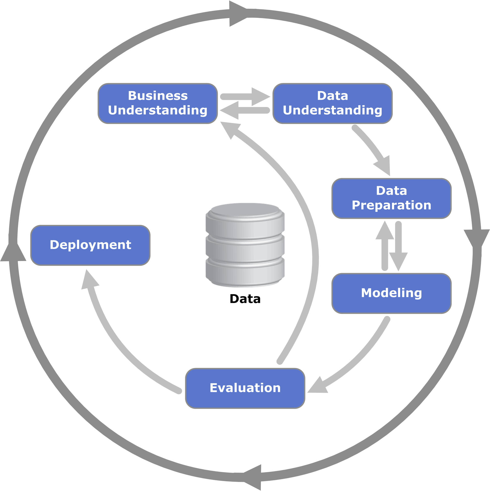

## Typische Fehler

- Package nicht geladen
- Pipe-Symbol falsch verwendet
- Unvollständige Code-Chunks

## Wir starten mit einer Übung

- Importieren Sie die beiden anderen Bücher-Datensätze
- Achten Sie auf die richtigen Datentypen beim Import
- Fällt Ihnen was auf bei den Altersangaben der Nutzer?
- Überlegen Sie, was die verbindenden Spalten sind, mit denen die Datensätze miteiner verbunden werden könnten

## Irgendwas stimmt mit dem Alter nicht

- Ein erster Blick in die Daten hilft, Probleme zu erkennen
- `summary()` gibt einen schnellen Überblick über alle Spalten
- Was fällt Ihnen bei der Ausgabe auf?

## summary() zeigt das Problem

- Aufruf: `summary(users$Age)`
- `Min.` kann 0 oder sogar negativ sein
- `Max.` zeigt Werte weit über 100 – unrealistisch
- Solche Ausreißer sind im rohen Datensatz schwer zu finden
- `summary()` macht sie sofort sichtbar

## Zurück zum Alter

- Was machen wir nun mit dieser Erkenntnis?
- Ergibt es Sinn, dass wir die Nutzer mit einem falschen Alter ausschließen?
- Oder sind ihre Bewertungen vielleicht doch nützlich?
- Wichtig: Diese Entscheidungen müssen dokumentiert werden!

## Warum sind Verteilungen wichtig?

- Sie zeigen, wie sich Werte über einen Bereich verteilen
- Sie verraten, ob Lagemaße (z.B. Mittelwert) überhaupt aussagekräftig sind
- Bei schiefen Verteilungen ist der Mittelwert **irreführend**
- Ausreißer werden auf einen Blick sichtbar
- Grundlage für statistische Tests: Viele Tests setzen eine bestimmte Verteilung voraus

## Histogramm

- Was: Grafische Darstellung der Häufigkeitsverteilung in Klassen
- Bestandteile: X-Achse (Werte), Y-Achse (Häufigkeit), Balken (Klassenhäufigkeit)
- Wozu: Schneller Überblick über Datenverteilung und -muster
- Interpretation: Form (symmetrisch/schief), Modalität (uni-/multimodal), Ausreißer
- Wichtig: Klassenanzahl beeinflusst sichtbare Form

## Demo

- Histogram mit ggplot

## Formparameter

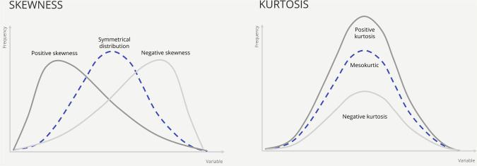

## Schiefe (Skewness)

- Misst die Asymmetrie einer Verteilung
- Positive Schiefe: rechtsschiefe Verteilung (längerer "Schwanz" nach rechts)
- Negative Schiefe: linksschiefe Verteilung (längerer "Schwanz" nach links)
- Schiefe von 0: symmetrische Verteilung (z.B. Normalverteilung)
- In R: `skewness(data)` aus dem Paket **moments** oder **e1071**

## Wölbung (Kurtosis)

- Misst die "Spitzheit" bzw. "Flachheit" einer Verteilung
- Normalverteilung hat eine Kurtosis von 3 (manchmal als Exzess-Kurtosis = 0 dargestellt)
- Hohe Kurtosis (\>3): spitze Verteilung mit "schweren Enden" (mehr Extremwerte)
- Niedrige Kurtosis (\<3): flache Verteilung mit "leichten Enden" (weniger Extremwerte)
- In R: `kurtosis(data)` aus dem Paket **moments** oder **e1071**

## Warum Visualisierung auch wichtig ist: Anscombes Quartet


## Let's talk about money

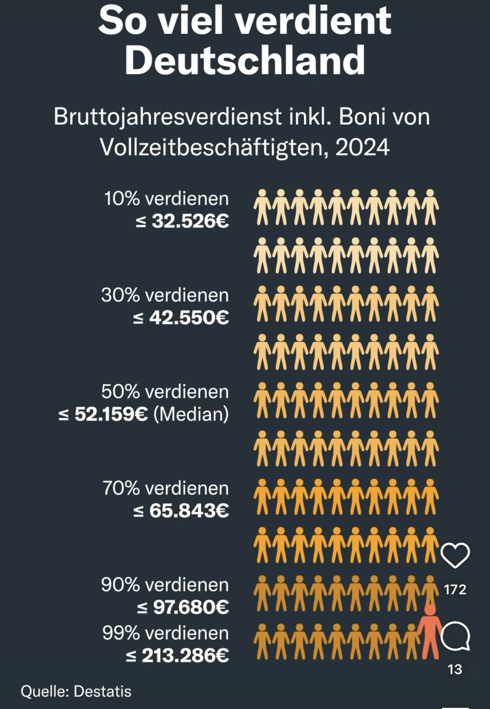

## Wie könnte man die Einkommensverteilung beschreiben?

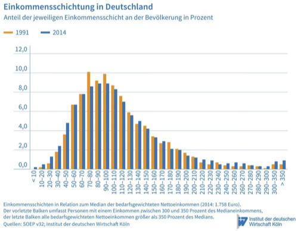 


## Im Durchschnitt haben Sie...

::::: columns
::: {.column width="50%"}

:::

::: {.column width="50%"}

:::
:::::

## Warum sind statistische Kennzahlen wichtig?

- **Reduktion von Komplexität**: Große Datenmengen werden durch wenige Werte beschreibbar
- **Kommunikation**: Leichtere Vermittlung von Erkenntnissen an Nicht-Statistiker
- **Vergleichbarkeit**: Unterschiedliche Datensätze werden vergleichbar

## Von der Beschreibung zur Inferenz

- Deskriptive Statistik als Grundlage für **statistische Tests**
- Möglichkeit der **Stichprobenerhebung** statt Vollerhebung
- Basis für **statistische Modellierung** und **Vorhersagen**

## Erkennung von Mustern und Besonderheiten

- **Ausreißer**: Potentielle Fehler oder besondere Fälle
- **Trends**: Entwicklungen über Zeit
- **Gruppenunterschiede**: Systematische Variation zwischen Teilgruppen

## Weitere Beispiele

| Anwendungsgebiet | Kennzahlen | Nutzen |
|------------------------|------------------------|------------------------|
| **Medizin** | Referenzwerte (z.B. Blutdruck, BMI) | Diagnostik, Risikoeinschätzung |
| **Finanzmarkt** | Volatilität (Standardabweichung) | Risikobewertung von Anlagen |
| **Qualitätssicherung** | Prozessfähigkeitsindizes (basierend auf σ) | Optimierung von Produktionsprozessen |
| **Sozialforschung** | Gini-Koeffizient (basierend auf Verteilung) | Ungleichheitsmaße in der Gesellschaft |
| **Meteorologie** | Durchschnittstemperaturen + Extremwerte | Klimaforschung, Wettervorhersage |

## Lagemaße

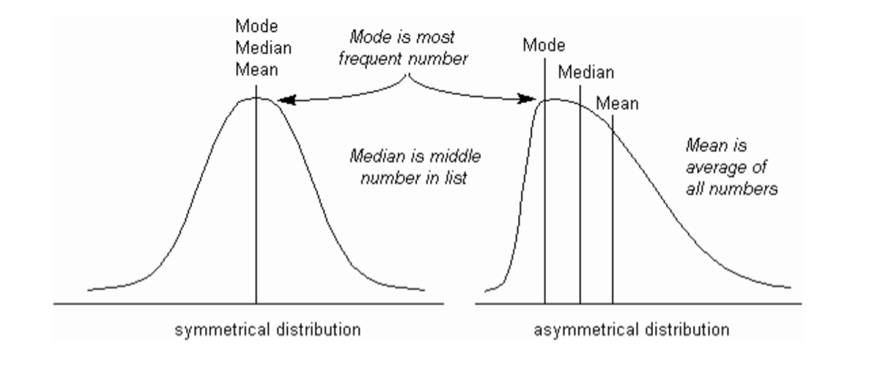

## Lagemaße

- Mean bezeichnet das arithmetische Mittel, häufig als „Durchschnitt" bezeichnet: mean()
- Neben dem arithmetischen Mittel existieren weitere Mittelwerte, zum Beispiel das geometrische Mittel
- Der Median ist weniger anfällig für Ausreißer: median()
- Der Modalwert kann auch mit kategorialen Variablen umgehen
- In R existiert kein Befehl für den Modalwert ☹

## Merke


## It really happened


## Auch die MOPO...


## Typisch / ungewöhnlich / unmöglich


## Typische Anwendungsfälle

| Kennzahl | Wichtig für... | Beispielanwendung |
|------------------------|------------------------|------------------------|
| **Mittelwert** | Durchschnittswerte, Summenbetrachtungen | Durchschnittseinkommen einer Region |
| **Median** | Typische Werte, robust gegen Ausreißer | Typisches Haushaltseinkommen |
| **Standardabweichung** | Streuung, Qualitätskontrolle | Produktionsgenauigkeit in der Fertigung |
| **Quartile/Boxplot** | Verteilungsform, Ausreißererkennung | Identifikation von Ungleichheiten |
| **Schiefe/Wölbung** | Abweichungen von der Normalverteilung | Risikobewertung im Finanzwesen |

## Weitere Positionskennwerte: Quantile und Perzentile

- Teile die Daten in gleich große Teile
- Median = 0,5-Quantil (50%-Perzentil)
- Quartile teilen die Daten in vier gleiche Teile:
  - Q1 = 0,25-Quantil (25%-Perzentil)
  - Q2 = 0,5-Quantil (50%-Perzentil) = Median
  - Q3 = 0,75-Quantil (75%-Perzentil)
- In R: `quantile(data, probs = c(0.25, 0.5, 0.75))` für Quartile

## Datensätze miteinander verbinden

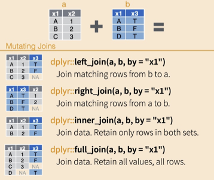


# Sitzung 5

## Streuungsmaße

## Spannweite (Range)

- Die Spannweite ist der einfachste Streuungsparameter
- Berechnung: Maximum - Minimum
- Sehr anfällig für Ausreißer
- In R: `diff(range(data))` oder `max(data) - min(data)`

## Interquartilsabstand (IQR)

- Robusteres Streuungsmaß, das Ausreißer besser berücksichtigt
- Berechnung: 75%-Quartil minus 25%-Quartil (Q3 - Q1)
- Enthält die mittleren 50% der Daten
- In R: `IQR(data)` oder `quantile(data, 0.75) - quantile(data, 0.25)`

## Varianz

- Durchschnittliche quadratische Abweichung vom Mittelwert
- Berechnung für Grundgesamtheit: $$\sigma^2 = \frac{1}{N} \sum_{i=1}^{N} (x_i - \mu)^2$$
- Berechnung für Stichprobe (korrigierte Varianz): $$s^2 = \frac{1}{n-1} \sum_{i=1}^{n} (x_i - \bar{x})^2$$
- Einheit: Quadrat der Einheit der Ursprungsdaten
- In R: `var(data)`

## Standardabweichung

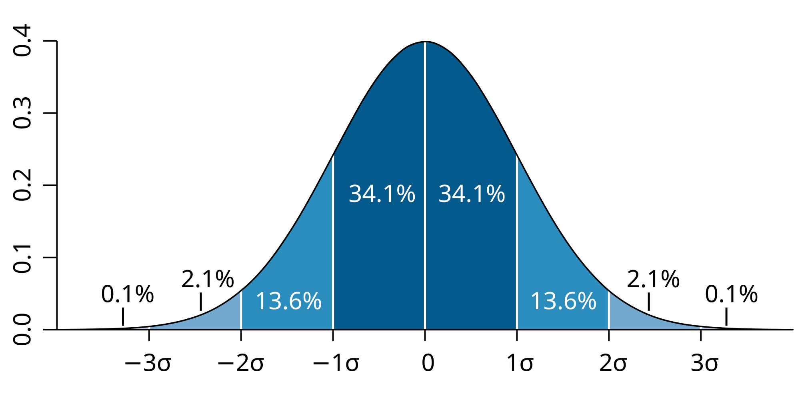

## Standardabweichung

- Wurzel aus der Varianz: Dieselbe Einheit wie die Ursprungsdaten
- Berechnung für Grundgesamtheit: $$\sigma = \sqrt{\frac{1}{N} \sum_{i=1}^{N} (x_i - \mu)^2}$$
- Berechnung für Stichprobe: $$s = \sqrt{\frac{1}{n-1} \sum_{i=1}^{n} (x_i - \bar{x})^2}$$
- In R: `sd(data)`

## Interpretation der Standardabweichung im Kontext der Normalverteilung

- Bei normalverteilten Daten liegen ca. 68% der Werte innerhalb von μ ± σ (Mittelwert ± 1 Standardabweichung)
- Ca. 95% der Werte liegen innerhalb von μ ± 2σ
- Ca. 99,7% der Werte liegen innerhalb von μ ± 3σ ("Drei-Sigma-Regel")


## Boxplot

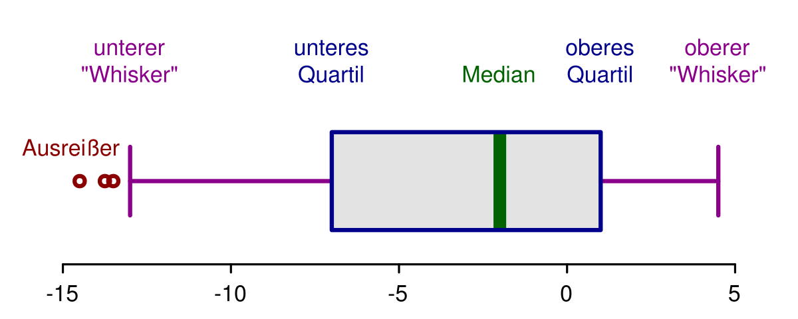

## Boxplot

- Visuelle Darstellung von Quartilen und Ausreißern
- Box: Interquartilsabstand (IQR) von Q1 bis Q3
- Mittellinie: Median (Q2)
- Whiskers: Typischerweise bis max. 1,5 × IQR von der Box
- Punkte außerhalb der Whiskers: potenzielle Ausreißer
- In R: `boxplot(data)`


## Wie macht man das in R?

| Kennzahl | R‑Befehl | Kurzbeschreibung |
|------------------------|------------------------|------------------------|
| Mittelwert | `mean(data)` | Durchschnitt aller Werte |
| Median | `median(data)` | Zentralwert (50 %-Quantil) |
| Minimum | `min(data)` | Kleinster Wert |
| Maximum | `max(data)` | Größter Wert |
| Spannweite | `diff(range(data))` | Abstand = Max − Min |
| Standardabweichung | `sd(data)` | Ø‑Abweichung vom Mittelwert |
| Varianz | `var(data)` | Quadrat der Standardabweichung |
| Schiefe | `skewness(data)` *(moments/e1071)* | Asymmetrie der Verteilung |
| Wölbung (Kurtosis) | `kurtosis(data)` *(moments/e1071)* | "Spitzheit" der Verteilung |
| Quantile | `quantile(data, c(.25,.5,.75))` | 25 %, 50 %, 75 %-Werte (Quartile) |

## Übung mit dem Datensatz iris

| Kennzahl           | R‑Befehl            | Kurzbeschreibung               |
|--------------------|---------------------|--------------------------------|
| Mittelwert         | `mean(data)`        | Durchschnitt aller Werte       |
| Median             | `median(data)`      | Zentralwert (50 %-Quantil)     |
| Minimum            | `min(data)`         | Kleinster Wert                 |
| Maximum            | `max(data)`         | Größter Wert                   |
| Spannweite         | `diff(range(data))` | Abstand = Max − Min            |
| Standardabweichung | `sd(data)`          | Ø‑Abweichung vom Mittelwert    |
| Varianz            | `var(data)`         | Quadrat der Standardabweichung |


## Demo

# Sitzung 5: Datenvisualisierung

## Lernziele dieser Sitzung

- Das richtige Diagramm für eine Fragestellung auswählen
- Grundprinzipien guter Visualisierung anwenden (Clutter, Highlighting, Storytelling)
- Diagramme mit ggplot2 erstellen
- Häufige Fehler bei der Datenvisualisierung vermeiden

## Warum Datenvisualisierung?

The greatest value of a picture is when it forces us to notice what we never expected to see. (John Tukey)

## Warum Datenvisualisierung, Teil 2


## 5 wichtige Schritte

1.  Was ist der Kontext?
    - An wen wird kommuniziert?
    - Was soll der Empfänger wissen oder tun?
    - Welche Daten sind vorhanden, um den Case zu untermauern?

## 5 wichtige Schritte

2.  Welche ist das passendste Visualierung?
    - Ein oder zwei Zahlen, die im Fokus stehen? =\> Text!
    - Liniendiagramme für continuous data
    - Säulendiagramme für kategoriale Daten, müssen bei 0 anfangen
    - Die Beziehungen der Daten untereinander bestimmen die Visualisierung, sofern Sie mehr als eine Variable haben
    - Vermeiden Sie Tortendiagramme, Donuts, 3D, zweite Y-Achsen

## 5 wichtige Schritte

3.  Entfernen Sie „Clutter"
    1.  Entfernen Sie alles, das keinen informativen Mehrwert hat (z.B. Farben für die Ästhetik)
    2.  Arbeiten Sie mit freiem Raum

## 5 wichtige Schritte

4.  Fokussieren Sie die Aufmerksamkeit, wo Sie hin soll
    - Größe, Position und, ja, manchmal auch Farbe nutzen um zu signalisieren, was wichtig ist
    - Wohin gehen die Augen?

## 5 wichtige Schritte

::::: columns
::: {.column width="60%"}
5.  Nutzen Sie Storytelling
    - Niemand will einfach nur Auflistungen von Zahlen und Diagrammen sehen.
    - Schreiben Sie einen Plot. Anfang, eventuell sogar einen Twist, und ein Ende mit Call to Action (in der Wissenschaft reicht eine Diskussion ☺)
    - Bitte arbeiten Sie nicht einfach nur mechanisch alles ab, was Sie können.
:::

::: {.column width="40%"}
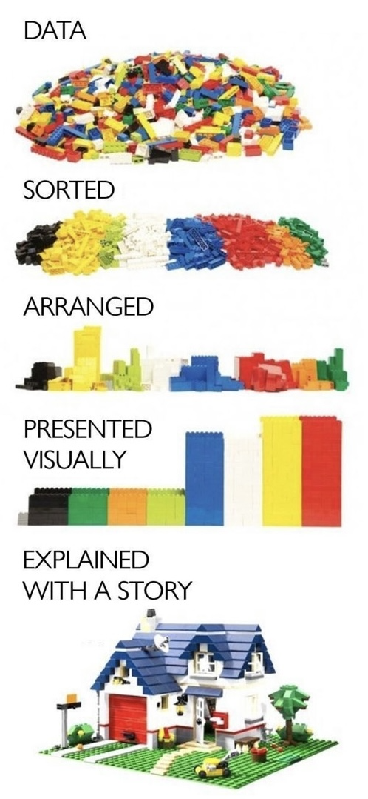
:::
:::::

## Redundant Coding

::::: columns
::: {.column width="50%"}
```{r, fig.width=10, fig.height=10, out.width="100%"}
# Pakete laden
library(ggplot2)

# Pakete laden
library(ggplot2)

# Linker Plot (mit Kreisen für alle Arten)
ggplot(iris, aes(x = Sepal.Length, y = Sepal.Width, color = Species)) +
  geom_point(size = 3, alpha = 0.7) +
  scale_color_manual(values = c("setosa" = "#d8b365", 
                               "virginica" = "#5ab4ac", 
                               "versicolor" = "#a6cee3")) +
  scale_x_continuous(limits = c(4, 8), breaks = seq(4, 8, 1)) +
  scale_y_continuous(limits = c(2, 4.5), breaks = seq(2, 4.5, 0.5)) +
  labs(x = "sepal length", y = "sepal width") +
  theme_bw() +
  theme(legend.position = "right",
        legend.title = element_blank(),
        panel.grid.minor = element_blank(),
        aspect.ratio = 1) # Macht den Plot quadratisch

# Um den Plot zu speichern mit quadratischen Abmessungen
# ggsave("iris_plot_left.png", width = 7, height = 7)
```
:::

::: {.column width="50%"}
```{r, fig.width=10, fig.height=10, out.width="100%"}
# Pakete laden
library(ggplot2)

# Rechter Plot (mit unterschiedlichen Symbolen für jede Art)
ggplot(iris, aes(x = Sepal.Length, y = Sepal.Width, 
                 color = Species, shape = Species)) +
  geom_point(size = 3, alpha = 0.7) +
  scale_color_manual(values = c("setosa" = "#a6cee3", 
                               "virginica" = "#5ab4ac", 
                               "versicolor" = "#d8b365")) +
  scale_shape_manual(values = c("setosa" = 16,  # Kreis (gefüllt)
                               "virginica" = 21, # Kreis (leer)
                               "versicolor" = 22)) + # Quadrat (leer)
  scale_x_continuous(limits = c(4, 8), breaks = seq(4, 8, 1)) +
  scale_y_continuous(limits = c(2, 4.5), breaks = seq(2, 4.5, 0.5)) +
  labs(x = "sepal length", y = "sepal width") +
  theme_bw() +
  theme(legend.position = "right",
        legend.title = element_blank(),
        panel.grid.minor = element_blank(),
        aspect.ratio = 1) # Macht den Plot quadratisch

# Um den Plot zu speichern mit quadratischen Abmessungen
# ggsave("iris_plot_right.png", width = 7, height = 7)
```
:::
:::::

## Weißer Space ist gut… aber nicht zu viel!

::::: columns
::: {.column width="50%"}
```{r}
# Benötigte Pakete
library(ggplot2)
library(dplyr)

# Daten vorbereiten (Titanic-Datensatz)
# Falls nicht vorhanden: install.packages("titanic")
library(titanic)
data("titanic_train")

# Daten aufbereiten
titanic_data <- titanic_train %>%
  mutate(
    Sex = factor(Sex, levels = c("female", "male")),
    Survived = factor(ifelse(Survived == 1, "survived", "died")),
    Pclass = factor(Pclass, labels = c("1st", "2nd", "3rd"))
  ) %>%
  count(Pclass, Sex, Survived) %>%
  rename(count = n)

# Linker Plot (komplett ohne Linien, "ugly")
ggplot(titanic_data, aes(x = Sex, y = count, fill = Sex)) +
  geom_col() +
  facet_grid(Pclass ~ Survived) +
  scale_fill_manual(values = c("female" = "#E69F00", "male" = "#4472C4")) +
  scale_y_continuous(limits = c(0, 180), breaks = c(0, 50, 100, 150)) +
  labs(y = "count") +
  theme(
    legend.position = "none",
    panel.spacing = unit(0.5, "mm"),      # Minimaler Abstand zwischen Panels
    panel.grid.major = element_blank(),   # Keine Hauptgitterlinien
    panel.grid.minor = element_blank(),   # Keine Nebengitterlinien
    panel.border = element_blank(),       # Kein Panelrahmen
    panel.background = element_blank(),   # Kein Panelhintergrund
    strip.background = element_blank(),   # Kein Hintergrund für Beschriftungen
    strip.text = element_text(hjust = 0.5, size = 10),
    axis.line = element_blank(),          # Keine Achsenlinien
    axis.ticks = element_blank(),         # Keine Achsenmarkierungen
    axis.title.x = element_blank(),
    plot.margin = unit(c(0.5, 0.5, 0.5, 0.5), "mm")  # Minimaler Außenabstand
  )
```
:::

::: {.column width="50%"}
```{r}
# Benötigte Pakete
library(ggplot2)
library(dplyr)

# Daten vorbereiten (Titanic-Datensatz)
# Falls nicht vorhanden: install.packages("titanic")
library(titanic)
data("titanic_train")

# Daten aufbereiten
titanic_data <- titanic_train %>%
  mutate(
    Sex = factor(Sex, levels = c("female", "male")),
    Survived = factor(ifelse(Survived == 1, "survived", "died")),
    Pclass = factor(Pclass, labels = c("1st", "2nd", "3rd"))
  ) %>%
  count(Pclass, Sex, Survived) %>%
  rename(count = n)

# Rechter Plot (mehr Weißraum, besser lesbar)
ggplot(titanic_data, aes(x = Sex, y = count, fill = Sex)) +
  geom_col() +
  facet_grid(Pclass ~ Survived) +
  scale_fill_manual(values = c("female" = "#E69F00", "male" = "#4472C4")) +
  scale_y_continuous(limits = c(0, 180), breaks = c(0, 50, 100, 150)) +
  labs(y = "count") +
  theme_minimal() +
  theme(
    legend.position = "none",
    panel.spacing = unit(5, "mm"),     # Mehr Abstand zwischen Panels
    panel.background = element_rect(fill = "#F1F1F1", color = NA), # Hellgrauer Hintergrund
    strip.background = element_rect(fill = "white", color = NA), # Weißer Streifen für Überschriften
    strip.text = element_text(hjust = 0.5, size = 10),
    axis.title.x = element_blank(),
    plot.margin = unit(c(5, 5, 5, 5), "mm")  # Mehr Außenabstand
  )
```
:::
:::::

## Highlighting

```{r}
# Benötigte Pakete laden
library(nycflights23)
library(dplyr)
library(ggplot2)

# Mittlere Ankunftsverspätung pro Fluggesellschaft berechnen
airline_delays <- flights %>%
  group_by(carrier) %>%
  summarise(mean_delay = mean(arr_delay, na.rm = TRUE)) %>%
  #filter(mean_delay > 0) %>%
  # Fluggesellschaftsnamen hinzufügen
  left_join(airlines, by = "carrier") %>%
  # Nach Verspätung sortieren
  arrange(mean_delay)

# Einen Vektor für Farben erstellen (alle grau außer ExpressJet, das hervorgehoben wird)
# ExpressJet hat im Datensatz den Code "EV"
farben <- ifelse(airline_delays$carrier == "G4", "#B22222", "#AAAAAA")

# Horizontalen Balkenplot erstellen
ggplot(airline_delays, aes(x = reorder(name, mean_delay), y = mean_delay)) +
  geom_col(fill = farben) +
  coord_flip() +  # Für horizontale Balken
  labs(
    title = "",
    x = "",
    y = "mean arrival delay (min.)"
  ) +
  theme_minimal() +
  theme(
    panel.grid.major.y = element_blank(),
    panel.grid.minor.y = element_blank()
  )
```

## Wie identifiziert man das richtige Diagramm?

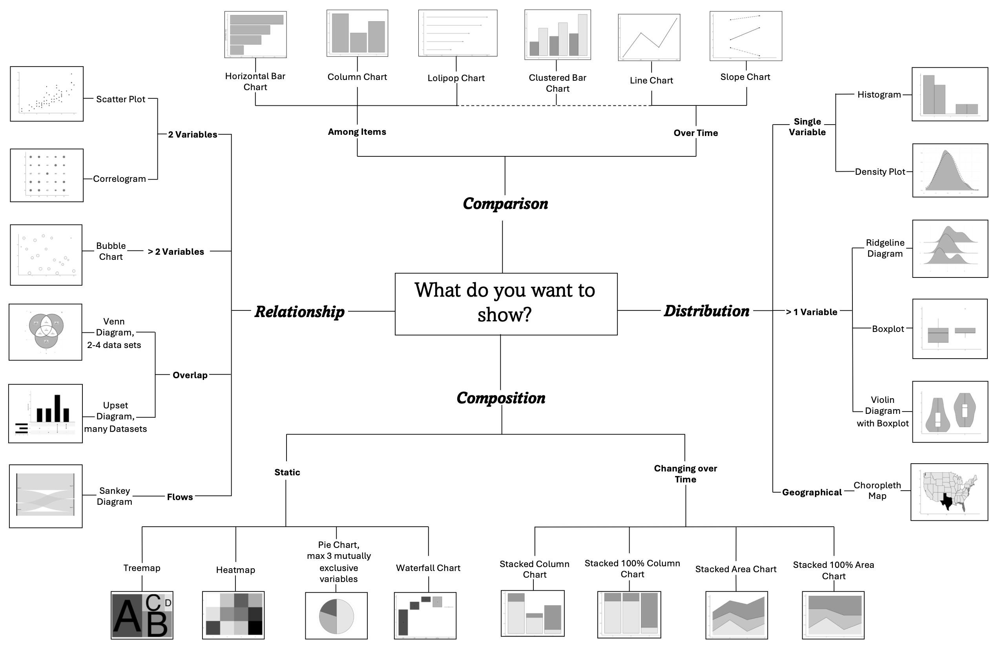

## Scatter Plot / Streudiagramm

::::: columns
::: {.column width="60%"}
- Zeigt Beziehung zwischen zwei kontinuierlichen Variablen
- Jeder Punkt = eine Beobachtung
- Erkennt Muster, Cluster, Ausreißer und Korrelationen
- Benötigt numerische X/Y-Achsen
- Dritte Dimension durch Punktgröße/Farbe möglich
:::

::: {.column width="40%"}
```{r}
#| echo: false
#| fig-width: 5
#| fig-height: 5
library(ggplot2)
set.seed(42)
scatter_data <- data.frame(
  x = rnorm(100),
  y = rnorm(100),
  gruppe = sample(LETTERS[1:3], 100, replace = TRUE)
)
# Korrelation hinzufügen
scatter_data$y <- scatter_data$y + scatter_data$x - 0.7 + rnorm(100, 0, 0.5)
ggplot(scatter_data, aes(x = x, y = y, color = gruppe)) +
  geom_point(size = 3, alpha = 0.7) +
  scale_color_brewer(palette = "Set1") +
  theme_minimal() +
  labs(x = "Variable X", y = "Variable Y", color = "Gruppe")
```
:::
:::::

## Korrelationsmatrix

::::: columns
::: {.column width="60%"}
- Zeigt Korrelationsstärke zwischen Variablen
- Farbe/Größe visualisiert Richtung und Stärke
- Unterscheidet klar positive/negative Korrelationen
- Identifiziert Muster und redundante Variablen
- Essentiell für explorative Datenanalyse
:::

::: {.column width="40%"}
```{r}
#| echo: false
#| fig-width: 5
#| fig-height: 5
library(ggplot2)
library(reshape2)

# Direkt eine gültige Korrelationsmatrix erstellen
set.seed(123)
vars <- 5
varNames <- LETTERS[1:vars]

# Simulierte Daten direkt erstellen
sim_data <- data.frame(
  A = rnorm(100),
  B = rnorm(100),
  C = rnorm(100),
  D = rnorm(100),
  E = rnorm(100)
)
# Korrelationen hinzufügen
sim_data$B <- sim_data$B + sim_data$A - 0.7 + rnorm(100, 0, 0.5)
sim_data$C <- sim_data$C - sim_data$A - 0.4 + rnorm(100, 0, 0.5)
sim_data$D <- sim_data$D + sim_data$B - 0.6 + rnorm(100, 0, 0.5)
sim_data$E <- sim_data$E - sim_data$C - 0.5 + sim_data$D - 0.3 + rnorm(100, 0, 0.5)

# Korrelationsmatrix berechnen
cormat <- round(cor(sim_data), 2)
melted_cormat <- melt(cormat)

ggplot(melted_cormat, aes(x = Var1, y = Var2, fill = value)) +
  geom_tile(color = "white") +
  scale_fill_gradient2(low = "firebrick", high = "steelblue", mid = "white", 
                     midpoint = 0, limit = c(-1,1)) +
  geom_text(aes(label = round(value, 2)), color = "black", size = 3) +
  theme_minimal() +
  coord_equal() +
  labs(fill = "Korrelation")
```
:::
:::::

## Venn-Diagramm

::::: columns
::: {.column width="60%"}
- Zeigt gemeinsame und einzigartige Elemente
- Überschneidungen visualisieren Gemeinsamkeiten
- Ideal für Vergleich von Kategorien/Merkmalen
- Funktioniert am besten mit 2-3 Gruppen
- Wird mit mehr als 5 Gruppen unübersichtlich
:::

::: {.column width="40%"}
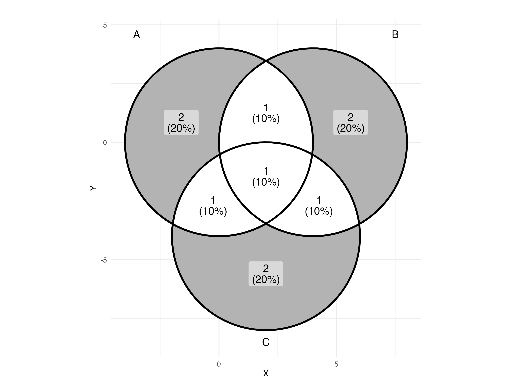
:::
:::::

## UpSet Diagram

::::: columns
::: {.column width="60%"}
- Alternative für komplexe Überschneidungen
- Skalierbarer als klassische Venn-Diagramme
- Balken visualisieren Überschneidungsgrößen
- Punkte zeigen beteiligte Mengen
- Ideal für 4+ Gruppen/komplexe Beziehungen
:::

::: {.column width="40%"}
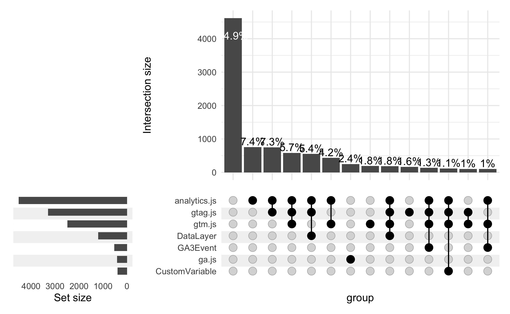
:::
:::::

## Sankey Diagram

::::: columns
::: {.column width="60%"}
- Visualisiert Flüsse zwischen Kategorien
- Pfeilbreite zeigt Volumen/Wert
- Ideal für Verteilungen und Prozesse
- Zeigt Herkunft und Ziel von Ressourcen
- Verdeutlicht Proportionen über mehrere Stufen
:::

::: {.column width="40%"}
```{r}
#| echo: false
#| fig-width: 5
#| fig-height: 5
library(ggplot2)
library(ggalluvial)
# Sankey/Alluvial Diagramm
sankey_data <- data.frame(
  Quelle = rep(c("A", "B", "C"), times = c(3, 2, 2)),
  Ziel = c("X", "Y", "Z", "X", "Y", "Y", "Z"),
  Wert = c(5, 3, 2, 2, 3, 1, 4)
)
ggplot(sankey_data, aes(axis1 = Quelle, axis2 = Ziel, y = Wert)) +
  geom_alluvium(aes(fill = Quelle), width = 1/3) +
  geom_stratum(width = 1/3, fill = "grey80", color = "grey50") +
  geom_text(stat = "stratum", aes(label = after_stat(stratum))) +
  scale_fill_brewer(palette = "Set1") +
  theme_minimal() +
  labs(x = NULL, y = NULL) +
  theme(legend.position = "none",
        axis.text.y = element_blank(),
        axis.ticks = element_blank())
```
:::
:::::

## Horizontal Bar Chart

::::: columns
::: {.column width="60%"}
- Vergleicht Werte über Kategorien hinweg
- Horizontale Anordnung für bessere Lesbarkeit
- Ideal für lange Namen oder viele Kategorien
- Perfekt für Rankings und Wertvergleiche
- Einfach und übersichtlich
:::

::: {.column width="40%"}
```{r}
#| echo: false
#| fig-width: 5
#| fig-height: 5
library(ggplot2)
hbar_data <- data.frame(
  kategorie = c("Kategorie mit sehr langem Namen A", 
                "Kategorie B", 
                "Kategorie C", 
                "Kategorie D", 
                "Kategorie E"),
  wert = c(85, 72, 56, 41, 25)
)
ggplot(hbar_data, aes(x = reorder(kategorie, wert), y = wert)) +
  geom_bar(stat = "identity", fill = "steelblue") +
  coord_flip() +
  theme_minimal() +
  labs(x = NULL, y = "Wert") +
  geom_text(aes(label = wert), hjust = -0.2) +
  ylim(0, max(hbar_data$wert) - 1.15)
```
:::
:::::

## Column Chart

::::: columns
::: {.column width="60%"}
- Vergleicht Werte mit vertikalen Balken
- Ideal für Ranking und Leistungsvergleiche
- Funktioniert gut mit wenigen, klaren Kategorien
- Kurze, lesbare Beschriftungen bevorzugen
- Konsistente Nullbasislinie für faire Vergleiche
:::

::: {.column width="40%"}
```{r}
#| echo: false
#| fig-width: 5
#| fig-height: 5
library(ggplot2)
column_data <- data.frame(
  kategorie = factor(c("A", "B", "C", "D", "E"), levels = c("A", "B", "C", "D", "E")),
  wert = c(85, 72, 56, 41, 25)
)
ggplot(column_data, aes(x = kategorie, y = wert, fill = kategorie)) +
  geom_bar(stat = "identity", width = 0.7) +
  scale_fill_brewer(palette = "Set2") +
  theme_minimal() +
  labs(x = NULL, y = "Wert") +
  theme(legend.position = "none") +
  geom_text(aes(label = wert), vjust = -0.5) +
  ylim(0, max(column_data$wert) - 1.1)
```
:::
:::::

## Vergleich: Horizontal vs. Vertical Bar Charts

| Feature | Horizontal | Vertical |
|------------------------|------------------------|------------------------|
| Best for | Long category labels, many items | Time-based or logical progression |
| Readability | Easier when labels are long | Requires rotation for long labels |
| Use case | Rankings, survey responses | Trends over time, grouped comparisons |
| Scan direction | Left to right | Bottom to top |
| Visual space | Efficient for many categories | Better for fewer, high-impact bars |

## Diverging Bars

::::: columns
::: {.column width="60%"}
- Zeigt Abweichungen in zwei Richtungen
- Links/rechts von zentraler Basislinie
- Ideal für Kontraste (positiv/negativ)
- Zeigt Gleichgewicht vs. Ungleichgewicht
- Gut für normalisierte Werte oder Z-Scores
:::

::: {.column width="40%"}
```{r}
#| echo: false
#| fig-width: 5
#| fig-height: 5
library(ggplot2)
diverging_data <- data.frame(
  category = factor(LETTERS[1:8], levels = LETTERS[8:1]),
  value = c(5, -2, 8, -3, 6, -1, 4, -7)
)
ggplot(diverging_data, aes(x = category, y = value, fill = value > 0)) +
  geom_bar(stat = "identity") +
  scale_fill_manual(values = c("firebrick", "steelblue"), guide = "none") +
  coord_flip() +
  theme_minimal() +
  labs(y = "Abweichung vom Mittelwert")
```
:::
:::::

## Diverging Lollipop Chart

::::: columns
::: {.column width="60%"}
- Elegantere Alternative zu Diverging Bars
- Nutzt Punkte statt Balken (weniger Tinte)
- Zeigt Richtung und Magnitude effektiv
- Ideal wenn genaue Werte sekundär sind
- Besonders gut für Präsentationen
:::

::: {.column width="40%"}
```{r}
#| echo: false
#| fig-width: 5
#| fig-height: 5
library(ggplot2)
lollipop_data <- data.frame(
  category = factor(LETTERS[1:8], levels = LETTERS[8:1]),
  value = c(5, -2, 8, -3, 6, -1, 4, -7)
)
ggplot(lollipop_data, aes(x = category, y = value, color = value > 0)) +
  geom_segment(aes(y = 0, x = category, yend = value, xend = category), color = "grey") +
  geom_point(size = 3) +
  scale_color_manual(values = c("firebrick", "steelblue"), guide = "none") +
  coord_flip() +
  theme_minimal() +
  labs(y = "Abweichung vom Mittelwert")
```
:::
:::::

## Histogram

::::: columns
::: {.column width="60%"}
- Zeigt Verteilung numerischer Daten in Bins
- Balken zeigen Häufigkeiten in Wertebereichen
- Erkennt Schiefe, Streuung und Ausreißer
- Zeigt Modi und Clustering in Daten
- Berührende Balken betonen Kontinuität
:::

::: {.column width="40%"}
```{r}
#| echo: false
#| fig-width: 5
#| fig-height: 5
library(ggplot2)
set.seed(123)
hist_data <- data.frame(
  value = c(rnorm(400, mean = 5, sd = 1), rnorm(100, mean = 8, sd = 0.5))
)
ggplot(hist_data, aes(x = value)) +
  geom_histogram(bins = 30, fill = "steelblue", color = "white") +
  theme_minimal() +
  labs(y = "Häufigkeit")
```
:::
:::::

## Boxplots

::::: columns
::: {.column width="60%"}
- Zeigt Minimum, Quartile und Median
- Kompakte Darstellung von Verteilungen
- Hebt Streuung und Ausreißer hervor
- Ideal zum Kategorienvergleich
- Kann für Laien schwer verständlich sein
:::

::: {.column width="40%"}
```{r}
#| echo: false
#| fig-width: 5
#| fig-height: 5
library(ggplot2)
set.seed(123)
box_data <- data.frame(
  category = rep(c("A", "B", "C", "D"), each = 100),
  value = c(
    rnorm(100, mean = 5, sd = 1),
    rnorm(100, mean = 7, sd = 1.5),
    rnorm(100, mean = 4, sd = 0.8),
    rnorm(100, mean = 6, sd = 2)
  )
)
ggplot(box_data, aes(x = category, y = value, fill = category)) +
  geom_boxplot() +
  scale_fill_brewer(palette = "Set2", guide = "none") +
  theme_minimal()
```
:::
:::::

## Boxplot mit unseren Verspätungsdaten

```{r}
# Benötigte Pakete laden
library(nycflights23)
library(dplyr)
library(ggplot2)

# Daten filtern (nur positive Verspätungen) und vorbereiten
delay_data <- flights %>%
  left_join(airlines, by = "carrier")  # Fluggesellschaftsnamen hinzufügen

# Reihenfolge der Fluggesellschaften nach Median-Verspätung festlegen
carrier_order <- delay_data %>%
  group_by(carrier, name) %>%
  summarise(median_delay = median(arr_delay, na.rm = TRUE), .groups = "drop") %>%
  arrange(median_delay)

# Farben definieren (ExpressJet hervorgehoben, Rest grau)
# (Angenommen, Sie möchten ExpressJet hervorheben, das Code "EV" hat)
delay_data$color <- ifelse(delay_data$carrier == "G4", "#B22222", "#AAAAAA")

# Boxplot erstellen
ggplot(delay_data, aes(x = factor(name, levels = carrier_order$name), y = arr_delay)) +
  geom_boxplot(aes(fill = color), outlier.shape = NA, varwidth = TRUE) +  # outlier.shape = NA entfernt Ausreißer für bessere Lesbarkeit
  coord_flip() +  # Horizontale Boxplots
  scale_fill_identity() +  # Verwende die definierten Farben direkt
  scale_y_continuous(limits = c(-50, 150)) +  # Limitiere y-Achse für bessere Lesbarkeit
  labs(
    title = "Verteilung der Ankunftsverspätungen nach Fluggesellschaft",
    x = "",
    y = "arrival delay (min.)"
  ) +
  theme_minimal() +
  theme(
    panel.grid.major.y = element_blank(),
    panel.grid.minor.y = element_blank()
  )
```

## Boxplots mit Violin Plot

::::: columns
::: {.column width="60%"}
- Kombiniert Boxplot mit Dichteverteilung
- Zeigt Form, Streuung und zentrale Tendenz
- Ideal für Gruppenvergleiche
- Verdeutlicht Schiefe und Multimodalität
- Informationsreichere Alternative zum Boxplot
:::

::: {.column width="40%"}
```{r}
#| echo: false
#| fig-width: 5
#| fig-height: 5
library(ggplot2)
set.seed(123)
violin_data <- data.frame(
  category = rep(c("A", "B", "C"), each = 100),
  value = c(
    c(rnorm(50, 5, 1), rnorm(50, 8, 0.5)),
    rnorm(100, 7, 1.5),
    rnorm(100, 6, 0.7)
  )
)
ggplot(violin_data, aes(x = category, y = value, fill = category)) +
  geom_violin(alpha = 0.7) +
  geom_boxplot(width = 0.2, fill = "white", alpha = 0.7) +
  scale_fill_brewer(palette = "Set2", guide = "none") +
  theme_minimal()
```
:::
:::::

## Choropleth Map

::::: columns
::: {.column width="60%"}
- Färbt Regionen basierend auf Datenwerten
- Zeigt räumliche Muster und Unterschiede
- Gut für Verhältnisse und Prozentsätze
- Nutze normalisierte Daten (pro Kopf, %)
- Vorsicht bei großen Flächenunterschieden
:::

::: {.column width="40%"}
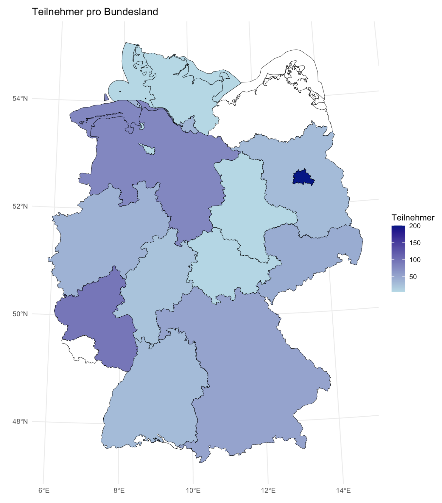
:::
:::::

## Stacked Area Chart

::::: columns
::: {.column width="60%"}
- Zeigt Kategorienbeiträge im Zeitverlauf
- Gestapelte Schichten zeigen Gesamtsumme
- Gut für Wachstum und Anteile
- Funktioniert am besten mit wenigen Kategorien
- Einzelsegmentvergleich schwierig
:::

::: {.column width="40%"}
```{r}
#| echo: false
#| fig-width: 5
#| fig-height: 5
library(ggplot2)
set.seed(42)
years <- 2010:2020
area_data <- data.frame(
  year = rep(years, 4),
  category = rep(c("A", "B", "C", "D"), each = length(years)),
  value = c(
    10:20 + rnorm(11, 0, 1),
    20:30 - rnorm(11, 0, 1),
    15:25 + rnorm(11, 0, 2),
    25:35 + rnorm(11, 0, 1.5)
  )
)
ggplot(area_data, aes(x = year, y = value, fill = category)) +
  geom_area() +
  scale_fill_brewer(palette = "Set2") +
  theme_minimal()
```
:::
:::::

## Stacked 100% Area Chart

::::: columns
::: {.column width="60%"}
- Zeigt relative Anteile, nicht absolute Werte
- Verfolgt Änderungen von Kategorienanteilen
- Summe immer 100% für leichte Vergleichbarkeit
- Fokus auf Zusammensetzung, nicht Wachstum
- Absolute Trends gehen verloren
:::

::: {.column width="40%"}
```{r}
#| echo: false
#| fig-width: 5
#| fig-height: 5
library(ggplot2)
set.seed(42)
years <- 2010:2020
area100_data <- data.frame(
  year = rep(years, 4),
  category = rep(c("A", "B", "C", "D"), each = length(years)),
  value = c(
    10:20 + rnorm(11, 0, 1),
    20:30 - rnorm(11, 0, 1),
    15:25 + rnorm(11, 0, 2),
    25:35 + rnorm(11, 0, 1.5)
  )
)
ggplot(area100_data, aes(x = year, y = value, fill = category)) +
  geom_area(position = "fill") +
  scale_y_continuous(labels = scales::percent) +
  scale_fill_brewer(palette = "Set2") +
  theme_minimal() +
  labs(y = "Anteil")
```
:::
:::::

## Stacked 100% Area Chart Beispiel


## Waterfall Diagram

::::: columns
::: {.column width="60%"}
- Zeigt Beiträge zu einer Gesamtsumme
- Visualisiert Zu- und Abnahmen über Kategorien
- Hebt schrittweise Veränderungen hervor
- Ideal für Gewinn- oder Budgetanalysen
- Zeigt Faktoren für das Endergebnis
:::

::: {.column width="40%"}
```{r}
#| echo: false
#| fig-width: 5
#| fig-height: 5
library(ggplot2)
waterfall_data <- data.frame(
  stage = factor(c("Start", "Einnahmen", "Kosten", "Steuern", "Ende"), 
                levels = c("Start", "Einnahmen", "Kosten", "Steuern", "Ende")),
  value = c(0, 50, -30, -10, 0),
  end = c(100, 150, 120, 110, 110),
  start = c(100, 100, 150, 120, 110),
  type = c("total", "in", "out", "out", "total")
)
ggplot(waterfall_data, aes(x = stage, y = value, fill = type)) +
  geom_rect(aes(x = stage, xmin = as.numeric(stage) - 0.4, 
                xmax = as.numeric(stage) + 0.4, 
                ymin = pmin(start, end), ymax = pmax(start, end)), color = "black") +
  scale_fill_manual(values = c("in" = "steelblue", "out" = "firebrick", "total" = "darkgrey"), 
                    guide = "none") +
  theme_minimal() +
  labs(y = "Wert")
```
:::
:::::

## Heatmap

::::: columns
::: {.column width="60%"}
- Nutzt Farbintensität für Matrixwerte
- Zeigt Muster, Cluster und Anomalien
- Gut für Korrelationen und Zeitreihen
- Einfach zu überblicken, weniger präzise
- Farbskala entscheidend für Interpretation
:::

::: {.column width="40%"}
```{r}
#| echo: false
#| fig-width: 5
#| fig-height: 5
library(ggplot2)
set.seed(42)
n <- 10
heatmap_data <- expand.grid(x = 1:n, y = 1:n)
heatmap_data$value <- matrix(rnorm(n^2), n, n)[cbind(heatmap_data$x, heatmap_data$y)]
ggplot(heatmap_data, aes(x = x, y = y, fill = value)) +
  geom_tile() +
  scale_fill_viridis_c() +
  theme_minimal() +
  coord_equal() +
  labs(x = "", y = "")
```
:::
:::::

## Treemap

::::: columns
::: {.column width="60%"}
- Zeigt Teil-Ganzes-Beziehungen mit Rechtecken
- Größe entspricht dem Wert (Umsatz, Anzahl)
- Visualisiert Hierarchien und Gruppierungen
- Gut für Proportionsvergleiche
- Vorsicht bei zu vielen kleinen Elementen
:::

::: {.column width="40%"}
```{r}
#| echo: false
#| fig-width: 5
#| fig-height: 5
library(ggplot2)
library(treemapify)
treemap_data <- data.frame(
  category = c("A", "B", "C", "D", "E", "F"),
  subcategory = c("A1", "B1", "C1", "D1", "E1", "F1"),
  value = c(25, 18, 12, 10, 8, 5)
)
ggplot(treemap_data, aes(area = value, fill = category, label = subcategory)) +
  geom_treemap() +
  geom_treemap_text(color = "white", fontface = "bold") +
  scale_fill_brewer(palette = "Set2") +
  theme_void()
```
:::
:::::

## Treemap


## Nein, Sie verwenden bitte keine Pie Charts!


## Datenvisualisierung mit ggplot2

- Base Plot vs. ggplot2
- Grammar of Graphics
- `geom_point()`, `geom_histogram()`, `geom_boxplot()`
- Ästhetiken: Farbe, Form, Gruppierung


# Sitzung 6: Wahrscheinlichkeiten & Verteilungen

## Lernziele dieser Sitzung

- Grundbegriffe der Wahrscheinlichkeitstheorie erklären
- Diskrete und stetige Verteilungen unterscheiden
- Die Normalverteilung und ihre Eigenschaften kennen
- Den Zusammenhang zwischen Verteilungen und Inferenz verstehen

## Organisatorisches

- Die Veranstaltung findet nächste Woche statt!
- Zu viel los zum Semesterende? Sie können früher abgeben!
- Bitte bitte bitte beachten Sie die zur Verfügung gestellten Materialien!
- Nachtrag Stacked Area Charts

## Ihre Aufgabe heute

1.  Notebook ist erstellt (mit der Vorlage)
2.  Ihre Daten sind importiert
3.  Forschungsfragen sind ausformuliert im Notebook
4.  **Erst dann** besprechen wir im 1:1 Ihr weiteres Vorgehen, über dass Sie sich **vorher** Gedanken gemacht haben
5.  Nur wenn Sie gar nicht weiterkommen (und wirklich alle Materialien gesichtet haben), kommen Sie ohne diese Schritte zum 1:1

## Von der Beschreibung zur Vorhersage

- **Bisherige Sitzungen**: Daten beschreiben, manipulieren, visualisieren
- **Neuer Schritt**: Von Beschreibung zu Vorhersage und Schlussfolgerung
- **Schlüsselfrage**: Wie können wir mit Unsicherheit umgehen?
- **Antwort**: Wahrscheinlichkeitstheorie als mathematisches Fundament

## Warum Wahrscheinlichkeiten für die angewandte Forschung?

- **Stichprobenlogik**\
  → Wie kann auf eine Grundgesamtheit geschlossen werden, obwohl nur ein Teil beobachtet wurde?

- **Unsicherheit quantifizieren**\
  → Wie kann die Unsicherheit in empirischen Aussagen formal greifbar gemacht werden?

- **Zufallsvariabilität verstehen**\
  → Wie unterscheiden sich echte Effekte von zufälligen Schwankungen?

## Warum Wahrscheinlichkeiten für die angewandte Forschung? Teil 2

- **Grundlage für Inferenz**\
  → Wahrscheinlichkeiten bilden das Fundament für Hypothesentests und Konfidenzintervalle.

- **Bewertung von Evidenz**\
  → Wie plausibel ist eine Theorie angesichts der beobachteten Daten?

## Praktische Anwendungsbeispiele

- **Medizin**: Ist ein Medikament wirksam oder nur Zufall?
- **Wirtschaft**: Wie wahrscheinlich ist ein Zahlungsausfall?
- **Produktentwicklung**: Wie viele Nutzer werden Feature X verwenden?
- **Marketing**: Welcher von zwei Werbetexten führt zu mehr Conversions?
- **Qualitätssicherung**: Liegt der Produktionsprozess in kontrollierten Grenzen?

## Einführung in Wahrscheinlichkeiten

### Was ist Zufall?

## Einführung in Wahrscheinlichkeiten

### Was ist Zufall?

- In der Statistik beschreibt „Zufall“ das Eintreten von Ereignissen, deren Ergebnis nicht mit Sicherheit vorhersehbar ist, obwohl alle möglichen Ergebnisse bekannt sind.

- Der Zufall steht nicht für Chaos, sondern für Unsicherheit bei einzelnen Beobachtungen. Bei vielen Wiederholungen entstehen jedoch erkennbare Muster (z. B. 50 % Kopf bei Münzwürfen über viele Versuche).

## Laplace-Wahrscheinlichkeit

Wenn alle Ergebnisse gleich wahrscheinlich sind, kann man die Wahrscheinlichkeit eines Ereignisses berechnen als:

$$P(Ereignis) = \frac{\text{Anzahl günstiger Fälle}}{\text{Anzahl möglicher Fälle}}$$

**Beispiel:** Beim Würfeln ist die Wahrscheinlichkeit, eine 4 zu würfeln: $$\frac{1}{6}$$

## Empirische Wahrscheinlichkeit

Die empirische oder relative Häufigkeit basiert auf Beobachtungen:

$$P(Ereignis) \approx \frac{\text{Anzahl des Eintretens}}{\text{Anzahl der Wiederholungen}}$$

**Beispiel in R:**

```{r echo=TRUE}
set.seed(1234)
würfe <- sample(1:6, 1000, replace = TRUE)
mean(würfe == 4)  # Schätzung der Wahrscheinlichkeit für eine 4
```

## Theoretische Wahrscheinlichkeit

- Basierend auf einem **mathematischen Modell**, z. B. einer Verteilung
- Wird **nicht beobachtet**, sondern **aus Annahmen berechnet**

## Theoretische Wahrscheinlichkeit

- Beispiel: Wenn $$X \sim \text{Binomial}(n=10, p=0.3)$$, dann ist:

$$ P(X=2) = \binom{10}{2} \cdot 0{,}3^2 \cdot 0{,}7^8 \approx 0{,}2668 $$

- Die theoretische Wahrscheinlichkeit gibt an, **wie wahrscheinlich ein Ergebnis laut Modell ist**

→ Sie ist zentral in der Inferenz: **Beobachtungen werden mit der Theorie verglichen**

## Bedingte Wahrscheinlichkeit

Die bedingte Wahrscheinlichkeit ( P(A\|B) ) beschreibt die Wahrscheinlichkeit für A unter der Bedingung, dass B bereits eingetreten ist.

$$P(A|B) = \frac{P(A \cap B)}{P(B)}$$

**Beispiel:** In einer medizinischen Studie haben 20 % der Patienten eine Krankheit (B), und 80 % von diesen zeigen ein Symptom (A). Dann ist:

$$P(A|B) = 0.8$$

## Beispiele von Wahrscheinlichkeiten

| Art | Grundlage | Beispiel |
|------------------------|------------------------|------------------------|
| **Klassische (Laplace)** | Symmetrische Ausgangslage | P(4) bei Würfel = 1/6 |
| **Empirische** | Beobachtete relative Häufigkeit | 234 von 1000 Mails geöffnet → P = 0,234 |
| **Theoretische** | Abgeleitet aus Verteilungsmodell | P(X = 2) aus Binomial(n=10, p=0.3) |
| **Bedingte** | P(A\|B): A unter der Bedingung B | P(Fieber \| krank) |

## Von einzelnen Wahrscheinlichkeiten zu Verteilungen

- Eine **Wahrscheinlichkeitsverteilung** beschreibt alle möglichen Ausgänge eines Zufallsexperiments und ihre Wahrscheinlichkeiten.

------------------------------------------------------------------------

## Zwei Typen:

### Diskret (z. B. Würfelwurf)

- Endlich viele mögliche Ergebnisse
- Jedem Ergebnis wird eine konkrete Wahrscheinlichkeit zugewiesen
- Beispiel: P(Würfel = 4) = 1/6\
  → Die **Verteilung** zeigt: Wie wahrscheinlich ist jede Zahl von 1 bis 6?

```{r echo=TRUE}
barplot(rep(1/6, 6), names.arg = 1:6, col = "skyblue",
        main ="Diskrete Verteilung: Würfelergebnis", ylab = "Wahrscheinlichkeit")
```

### Stetig (z.B. Körpergröße)

- Unendlich viele mögliche Werte (z. B. 172,1 cm, 172,11 cm, …)
- Einzelwerte haben Wahrscheinlichkeit = 0
- Stattdessen: Dichtefunktion über Intervalle
- Beispiel: Wie wahrscheinlich liegt eine Körpergröße zwischen 170 und 175 cm?

```{r}
x <- seq(150, 200, by = 0.1)
y <- dnorm(x, mean = 175, sd = 7)
plot(x, y, type = "l", col = "darkgreen", lwd = 2,
     main = "Stetige Verteilung: Körpergröße", ylab = "Dichte", xlab = "Größe in cm")
```

## Zufallsvariablen und Verteilungen

- **Wichtige diskrete Verteilungen**:
  - Binomialverteilung (Anzahl Erfolge bei n Versuchen)
  - Poisson-Verteilung (Anzahl Ereignisse in Zeitintervall)
- **Wichtige stetige Verteilungen**:
  - Gleichverteilung (konstante Wahrscheinlichkeitsdichte)
  - Normalverteilung (Gaußsche Glockenkurve)

## Die Normalverteilung im Detail

- **Eigenschaften**: Symmetrie, Mittelwert = Median = Modus
- **Standardnormalverteilung**: Z-Transformation
- **68-95-99,7 Regel** (Ein-, Zwei-, Dreisigma-Regel)
- **Praktische Bedeutung**: Warum so viele Phänomene normalverteilt sind

## Normalverteilung in der Praxis

- **Qualitätskontrolle**: Sind Abweichungen noch innerhalb der Spezifikation?
- **Medizinische Grenzwerte**: Was ist "normal" bei Laborwerten?
- **Notenverteilung**: Bewusster Umgang mit der Gauß'schen Glockenkurve
- **Messfehler**: Warum kleine Abweichungen wahrscheinlicher sind als große

## Aufgabe

- Welche Verteilungen erwarten Sie in Ihren Forschungsfragen?
- Welche Wahrscheinlichkeiten erwarten Sie?


# Sitzung 7: Einführung in die Inferenzstatistik

## Lernziele dieser Sitzung

- Den Zentralen Grenzwertsatz erklären und demonstrieren
- Nullhypothese und Alternativhypothese formulieren
- Einen t-Test in R durchführen und interpretieren
- p-Wert und Konfidenzintervall korrekt kommunizieren
- Fehler 1. und 2. Art sowie Effektgrößen einordnen

## Was ist Inferenzstatistik?

- Von der Stichprobe auf die Grundgesamtheit schließen
- Berücksichtigt Zufallsfehler und Unsicherheit
- Zentral: **Wahrscheinlichkeit**, **Stichprobenverteilung**, **Testen von Hypothesen**

## Würfeln und der Zufall: Zentraler Grenzwertsatz

- Jeder Studierende würfelt 10x → 1 Mittelwert
- Wiederholung über viele → Verteilung der Mittelwerte
- Was ist der Erwartungswert?

## Würfeln und der Zufall: Zentraler Grenzwertsatz

- Jeder Studierende würfelt 10x → 1 Mittelwert
- Wiederholung über viele → Verteilung der Mittelwerte
- Erwartungswert (fairer Würfel): 3.5

## Würfeln und der Zufall: Zentraler Grenzwertsatz

```{r}
# Simulation des Zentralen Grenzwertsatzes
n_samples <- 1000
sample_means <- numeric(n_samples)

for(i in 1:n_samples) {
  # Ziehe 30 Werte aus einer nicht-normalverteilten Grundgesamtheit
  sample_data <- runif(30, min=1, max=6)  # Gleichverteilung
  sample_means[i] <- mean(sample_data)
}

# Visualisierung der Verteilung der Stichprobenmittelwerte
hist(sample_means, breaks=30, main="Verteilung der Stichprobenmittelwerte",
     xlab="Mittelwert", probability=TRUE)
curve(dnorm(x, mean=mean(sample_means), sd=sd(sample_means)), 
      add=TRUE, col="red", lwd=2)
```

## Warum ist das wichtig?

- Diese Verteilung erlaubt uns Aussagen über:
  - Vertrauensbereiche (Konfidenzintervalle)
  - Signifikanztests (z. B. t-Test)
- **Beispiel**: Ist ein Würfel gezinkt?
- Stichprobe: z. B. Mittelwert = 3.8
- **Ist dieser Unterschied Zufall oder nicht?**

## Hypothesentesten: Grundlagen

- **Nullhypothese (H₀)**: Annahme keines Effekts/Unterschieds
- **Alternativhypothese (H₁)**: Annahme eines Effekts/Unterschieds
- **Arten von Hypothesen**:
  - Ungerichtete Hypothesen (zweiseitig): µ₁ ≠ µ₂
  - Gerichtete Hypothesen (einseitig): µ₁ \> µ₂ oder µ₁ \< µ₂

## Die Logik des Hypothesentestens

- **Indirekter Beweis**: Wir falsifizieren H₀ statt H₁ zu beweisen
- **Analogie zum Gerichtsprozess**: "Unschuldig bis zum Beweis der Schuld"
- **Entscheidungsbaum**: Wann wird H₀ beibehalten oder verworfen?

## Signifikanzniveau und p-Wert

- **Signifikanzniveau α**: Vorab festgelegte Irrtumswahrscheinlichkeit (typisch: 0.05)
- **p-Wert**: Wahrscheinlichkeit, die beobachteten (oder extremeren) Daten unter H₀ zu erhalten
- **Entscheidungsregel**: Verwerfe H₀, wenn p \< α
- **Kritische Werte**: Alternative Darstellung der Entscheidungsregel

## Von der Stichprobenverteilung zum t-Test

- Die **Stichprobenverteilung der Mittelwerte** zeigt: Wie stark Mittelwerte **zufällig schwanken**, selbst wenn H₀ stimmt
- Diese Schwankung hat eine Streuung: den **Standardfehler (SE)**

$$ SE = \frac{s}{\sqrt{n}} $$

- Der t-Test prüft, ob der beobachtete Mittelwert **außerhalb** dieser erwarteten Schwankung liegt

## Der Standardfehler

- **Definition**: Standardabweichung der Stichprobenmittelwerte
- **Praktische Bedeutung**: Je größer die Stichprobe, desto präziser die Schätzung

```{r echo=TRUE}
set.seed(422)
würfe <- sample(1:6, 60, replace = TRUE)
se <- sd(würfe) / sqrt(length(würfe))
se
```

```{r}
mean(würfe)
```

## t-Test in R (Einzelstichprobe)

::: small
```{r}
mean(würfe)
t.test(würfe, mu = 3.5)
```
:::

## Interpretation des t-Tests

- **p \< 0.05** → Ablehnung der Nullhypothese (Würfel evtl. gezinkt)
- **p ≥ 0.05** → Kein ausreichender Hinweis auf Manipulation

## Was ist denn nun „signifikant“?

- Ein signifikantes Ergebnis heißt nicht, dass es „wichtig“ ist
- Es heißt nur: Unterschied ist **nicht gut durch Zufall erklärbar**
- Immer im Kontext interpretieren (Effektgröße, Relevanz)

## Konfidenzintervalle

- **Definition**: Bereich, der mit einer bestimmten Wahrscheinlichkeit den wahren Parameter enthält

- **Interpretation**: Was bedeutet ein 95%-Konfidenzintervall?

- **Zusammenhang mit Hypothesentests**: Enthält ein 95%-KI den Wert der Nullhypothese?

## Experimentelles Design

- **Wichtige Konzepte**: Randomisierung, Kontrolle, Randomized Control Trial (RCT)
- **Experimentierfehler vermeiden**:
  - Placebo-Effekt
  - Hawthorne-Effekt
  - Observer Bias
  - Selection Bias

## Ursprung der t-Verteilung: William S. Gosset

- **William S. Gosset** war Chemiker und Statistiker bei der Guinness-Brauerei (Anfang 1900er).
- Aufgabe: Qualitätskontrolle (z. B. Stärkegehalt von Gerste messen).
- Problem: Nur **kleine Stichproben** pro Tag (z. B. n = 4 oder 5).
- Damalige Statistik: Basierte auf **großen Stichproben** und der **Normalverteilung**.

## Das statistische Problem

- Ziel: Testen, ob der Mittelwert von Proben vom Sollwert abweicht.
- Normalformel: $$\frac{\bar{x} - \mu}{\sigma / \sqrt{n}}$$ → funktioniert nur, wenn **σ** (Standardabweichung der Grundgesamtheit) bekannt ist.
- Bei kleinen n musste Gosset stattdessen **s** (Stichprobenstandardabweichung) verwenden: $$  \frac{\bar{x} - \mu}{s / \sqrt{n}}$$
- Folge: Diese Teststatistik **folgt nicht mehr der Normalverteilung**.

## Die Lösung

- Gosset zeigte: Die neue Verteilung hängt von der Anzahl an Beobachtungen ab → **Freiheitsgrade (n−1)**.
- Daraus entstand eine neue Verteilung: die **t-Verteilung mit df**.
- Diese berücksichtigt die **größere Unsicherheit bei kleinen n** durch dickere „Schwänze“ (heavy tails).

## Warum „Student“?

- Guinness verbot es Mitarbeitern, unter eigenem Namen zu publizieren.
- Gosset veröffentlichte 1908 unter dem Pseudonym **„Student“**:
  - *„The Probable Error of a Mean“* (in *Biometrika*)
- Der t-Test wurde dadurch bekannt als **„Student’s t-Test“**.

## Visualisierung unterschiedlicher t-Verteilungen

```{r}
    # Vergleich von t-Verteilungen mit unterschiedlichen Freiheitsgraden
    x <- seq(-4, 4, length.out = 1000)
    y_normal <- dnorm(x)
    y_t1 <- dt(x, df = 1)  # 1 Freiheitsgrad
    y_t5 <- dt(x, df = 5)  # 5 Freiheitsgrade
    y_t30 <- dt(x, df = 30)  # 30 Freiheitsgrade

    plot(x, y_normal, type="l", lwd=2, col="black", 
         main="t-Verteilungen im Vergleich zur Normalverteilung",
         xlab="x", ylab="Wahrscheinlichkeitsdichte")
    lines(x, y_t1, lwd=2, col="red")
    lines(x, y_t5, lwd=2, col="blue")
    lines(x, y_t30, lwd=2, col="green")
    legend("topright", 
           legend=c("Normalverteilung", "t (df=1)", "t (df=5)", "t (df=30)"),
           col=c("black", "red", "blue", "green"), lwd=2)
```

## Freiheitsgrade (Degrees of Freedom, df)

- Anzahl der **unabhängigen Informationen**, die zur Schätzung einer Größe verfügbar sind.
- Bei der Berechnung der **Stichprobenvarianz** geht 1 Freiheitsgrad verloren: \[ df = n - 1 \] (weil der Mittelwert bereits aus den Daten berechnet wurde)
- Freiheitsgrade bestimmen die **Form der t-Verteilung**:
  - Wenige df → **dickere Randbereiche**
  - Viele df → t-Verteilung nähert sich der **Normalverteilung**

## Freiheitsgrade (Degrees of Freedom, df)

- Freiheitsgrade sind wichtig für:
  - Auswahl des richtigen **kritischen t-Werts**
  - **Vertrauensintervalle** und **p-Werte**

## Arten von t-Tests

- **Einstichproben-t-Test**: Vergleich mit bekanntem oder hypothetischem Wert
  - Anwendungsbeispiel: Entspricht der mittlere Blutzuckerwert einer Patientengruppe dem Normalwert?
  - Formel: $t = \frac{\bar{x} - \mu_0}{s / \sqrt{n}}$

## Arten von t-Tests

- **Zweistichproben-t-Test (unabhängig)**: Vergleich zweier unabhängiger Gruppen
  - Anwendungsbeispiel: Unterscheiden sich die Testergebnisse zweier unterschiedlicher Lernmethoden?
  - Formel bei gleichen Varianzen: $t = \frac{\bar{x}_1 - \bar{x}_2}{s_p \sqrt{\frac{1}{n_1} + \frac{1}{n_2}}}$

## Arten von t-Tests

- **Gepaarter t-Test (abhängig)**: Vergleich verbundener Messungen
  - Anwendungsbeispiel: Vor-Nach-Vergleich einer Intervention
  - Formel: $t = \frac{\bar{d}}{s_d / \sqrt{n}}$

## Arten von t-Tests

- **Welch-Test**: Variante für ungleiche Varianzen
  - Anwendungsbeispiel: Wenn die Streuung in beiden Gruppen deutlich unterschiedlich ist
  - Angepasste Freiheitsgrade

## Voraussetzungen der t-Tests

- **Normalverteilung**: Robustheit bei Verletzungen
- **Varianzhomogenität**: Bedeutung und Tests (Levene-Test, F-Test)
- **Unabhängigkeit der Beobachtungen**: Kritisch für die Gültigkeit
- **Zentraler Grenzwertsatz als Rettungsanker**: Wann können wir uns darauf verlassen?

## Interpretation und Berichterstattung

- **Angabe des Konfidenzintervalls**: Zusätzliche Information zur Präzision
- **Standardisierte Berichtsform**: APA-Style für wissenschaftliche Publikationen
- **Beispiel**: "Ein unabhängiger t-Test zeigte einen signifikanten Unterschied zwischen den Gruppen (t(28) = 2.45, p = 0.02, d = 0.89). Die Experimentalgruppe (M = 25.3, SD = 4.2) erzielte höhere Werte als die Kontrollgruppe (M = 21.7, SD = 3.8)."

## Fehler beim Hypothesentesten

- **Fehler 1. Art (α-Fehler)**: Falsch-positive Entscheidung (H₀ fälschlicherweise verwerfen)
- **Fehler 2. Art (β-Fehler)**: Falsch-negative Entscheidung (H₀ fälschlicherweise beibehalten)
- **Power (1-β)**: Wahrscheinlichkeit, einen tatsächlich vorhandenen Effekt zu entdecken
- **Balanceakt**: Abwägung zwischen α und β

## Effektgröße beim t-Test: Cohen's d

**Das Problem:**

t = 3.45, p = 0.001 → "Signifikant!"

**Aber wie groß ist der Unterschied wirklich?**

**Cohen's d Formel:** $$d = \frac{\bar{x}_1 - \bar{x}_2}{s_{pooled}}$$

## Interpretation nach Cohen

| Cohen's d | Effektgröße | Beispiel                       |
|-----------|-------------|--------------------------------|
| **0.2**   | Klein       | Männer vs. Frauen: Körpergröße |
| **0.5**   | Mittel      | Therapie vs. Kontrollgruppe    |
| **0.8**   | Groß        | Experten vs. Anfänger          |

## Vier kritische Szenarien

| p-Wert    | Cohen's d | Interpretation               |
|-----------|-----------|------------------------------|
| p \> 0.05 | d \< 0.2  | ✅ Kein Effekt               |
| p \> 0.05 | d \> 0.5  | ⚠️ Zu kleine Stichprobe      |
| p \< 0.05 | d \> 0.5  | ✅ Signifikant & bedeutsam   |
| p \< 0.05 | d \< 0.2  | ❌ **"Signifikant trivial"** |


# Sitzung 8: Chi-Quadrat-Test für Häufigkeiten

## Lernziele dieser Sitzung

- Den Chi-Quadrat-Test für kategoriale Daten anwenden
- Anpassungstest und Unabhängigkeitstest unterscheiden
- Residuen und Effektstärken (Cramér's V) berechnen und interpretieren
- Voraussetzungen prüfen und Alternativen kennen (Fisher's Exakter Test)

------------------------------------------------------------------------

## Rückblick: Von t-Tests zu kategorialen Daten

- **Letzte Woche**: t-Tests für kontinuierliche Daten (Mittelwerte)
- **Heute**: Tests für kategoriale Daten (Häufigkeiten)
- **Verbindung**: Beide testen Hypothesen, aber mit verschiedenen Datentypen
- **Beispiel**: Statt "Ist der mittlere Würfelwert 3.5?" → "Sind alle Würfelseiten gleich häufig?"

------------------------------------------------------------------------

## Würfel-Motivation: Ein praktisches Problem

**Situation**: Ein Freund behauptet, sein Würfel sei fair

**Daten sammeln**: 60 Würfe

- 1er: 8 mal
- 2er: 12 mal
- 3er: 9 mal
- 4er: 11 mal
- 5er: 10 mal
- 6er: 10 mal

## Würfel-Motivation: Ein praktisches Problem

**Fragen**:

- Ist dieser Würfel fair?

- Wie können wir das statistisch testen?

- Was erwarten wir bei einem fairen Würfel?

**Bei fairem Würfel**: Jede Zahl sollte etwa 10 mal fallen (60 ÷ 6 = 10)

------------------------------------------------------------------------

## Einführung in kategoriale Datenanalyse

- **Charakteristika kategorialer Daten**:
  - Nominal (Geschlecht, Farben, Würfelzahlen)
  - Ordinal (Schulnoten, Zufriedenheitsskalen)
- **Häufigkeitstabellen**: Absolute und relative Häufigkeiten
- **Kontingenztabellen**: Darstellung von Zusammenhängen zwischen kategorialen Variablen

```{r}
# Beispiel: Würfeldaten einlesen
würfel_daten <- c(rep(1, 8), rep(2, 12), rep(3, 9), 
                  rep(4, 11), rep(5, 10), rep(6, 10))

# Häufigkeitstabelle erstellen
table(würfel_daten)
```

------------------------------------------------------------------------

## Der Chi-Quadrat-Test: Grundprinzip

- **Kernidee**: Vergleich beobachteter und erwarteter Häufigkeiten
- **Formel**: $\chi^2 = \sum \frac{(O - E)^2}{E}$
  - O: beobachtete Häufigkeit (observed)
  - E: erwartete Häufigkeit (expected)
- **Logik**: Große Abweichungen → große χ²-Werte → Hinweis auf Unterschied

------------------------------------------------------------------------

```{r}
# Beobachtete Häufigkeiten
beobachtet <- c(8, 12, 9, 11, 10, 10)
names(beobachtet) <- 1:6

# Erwartete Häufigkeiten (fairer Würfel)
erwartet <- rep(60/6, 6)  # 10 für jede Seite

# Chi-Quadrat-Wert manuell berechnen
chi_quadrat <- sum((beobachtet - erwartet)^2 / erwartet)
```

------------------------------------------------------------------------

## Visualisierung: Beobachtet vs Erwartet

```{r}
# Vergleichsplot erstellen
barplot(rbind(beobachtet, erwartet), 
        beside = TRUE, 
        names.arg = 1:6,
        legend.text = c("Beobachtet", "Erwartet"),
        col = c("lightblue", "salmon"),
        main = "Würfelergebnisse: Beobachtet vs Erwartet",
        xlab = "Würfelzahl", ylab = "Häufigkeit")
```

------------------------------------------------------------------------

## Chi-Quadrat-Test in R durchführen

```{r echo=TRUE}
# Automatischer Chi-Quadrat-Test
chi_test <- chisq.test(beobachtet)

# Kompakte Ausgabe
cat("χ² =", chi_test$statistic, 
    "| df =", chi_test$parameter, 
    "| p =", round(chi_test$p.value, 4))
```

------------------------------------------------------------------------

## Freiheitsgrade verstehen

- **Formel für Anpassungstest**: df = Kategorien - 1 = 6 - 1 = 5
- **Warum -1?**: Wenn 5 Häufigkeiten festgelegt sind, ist die 6. automatisch bestimmt
- **Einfluss auf kritische Werte**: Mehr Freiheitsgrade → höhere kritische Werte

------------------------------------------------------------------------

## Freiheitsgrade verstehen

```{r echo=TRUE}
# Kritische Werte anzeigen
qchisq(0.95, df = 5)  # 95%-Quantil
qchisq(0.99, df = 5)  # 99%-Quantil
```

------------------------------------------------------------------------

## Arten von Chi-Quadrat-Tests

### 1. Anpassungstest (Goodness-of-Fit)

- **Zweck**: Vergleich mit theoretischer Verteilung
- **Beispiel**: Ist unser Würfel fair?
- **H₀**: Alle Würfelseiten sind gleich wahrscheinlich
- **H₁**: Mindestens eine Seite weicht ab

## Unser Würfeltest

```{r echo=TRUE}

chisq.test(beobachtet, p = rep(1/6, 6))
```

------------------------------------------------------------------------

## Arten von Chi-Quadrat-Tests

### 2. Unabhängigkeitstest

- **Zweck**: Zusammenhang zwischen zwei kategorialen Variablen
- **Beispiel**: Hängt die Würfelzahl vom Werfer ab?

```{r}
# Simulierte Daten: Zwei Personen würfeln
set.seed(123)
person_a <- sample(1:6, 30, replace = TRUE)
person_b <- sample(1:6, 30, replace = TRUE, 
                   prob = c(0.1, 0.1, 0.2, 0.2, 0.2, 0.2))

# Kontingenztabelle erstellen
kontingenztab <- table(
  Person = rep(c("A", "B"), each = 30),
  Würfelzahl = c(person_a, person_b)
)
print(kontingenztab)
```

------------------------------------------------------------------------

## Unabhängigkeitstest durchführen

```{r}
# Chi-Quadrat-Test für Unabhängigkeit
chi_unabhängigkeit <- chisq.test(kontingenztab)
print(chi_unabhängigkeit)
```

------------------------------------------------------------------------

## Arten von Chi-Quadrat-Tests

### 3. Homogenitätstest

- **Zweck**: Vergleich von Verteilungen in verschiedenen Gruppen
- **Beispiel**: Haben drei verschiedene Würfel die gleiche Verteilung?

------------------------------------------------------------------------

## Voraussetzungen des Chi-Quadrat-Tests

1.  **Unabhängigkeit der Beobachtungen**
    - Jeder Würfelwurf unabhängig
    - Keine wiederholten Messungen derselben Person

## Voraussetzungen des Chi-Quadrat-Tests

2.  **Erwartete Häufigkeiten ≥ 5**
    - In jeder Zelle der Tabelle
    - Bei Verletzung: Kategorien zusammenfassen oder andere Tests

------------------------------------------------------------------------

## Alternativen bei kleinen Stichproben: Fisher's Exakter Test

- **Wann**: Erwartete Häufigkeiten \< 5 in 2×2-Tabellen
- **Vorteil**: Exakte p-Werte, keine Approximation

------------------------------------------------------------------------

## Visualisierung kategorialer Daten

```{r}
# Gruppierte Balkendiagramme
barplot(kontingenztab, beside = TRUE, 
        legend.text = TRUE, 
        col = c("lightblue", "salmon"),
        main = "Würfelergebnisse nach Person",
        xlab = "Würfelzahl", ylab = "Häufigkeit")
```

------------------------------------------------------------------------

## Mosaikplots

```{r}
# Mosaikplot erstellen
library(vcd)
mosaic(kontingenztab, shade = TRUE, 
       legend = TRUE, 
       main = "Zusammenhang: Person und Würfelergebnis")
```

------------------------------------------------------------------------

## Praktische Anwendungsbeispiele

### Marktforschung

- **Frage**: Bevorzugen verschiedene Altersgruppen unterschiedliche Produktfarben?
- **Test**: Unabhängigkeitstest (Alter × Farbpräferenz)

### Medizin

- **Frage**: Ist ein neues Medikament wirksam?
- **Test**: Unabhängigkeitstest (Behandlung × Heilung)

------------------------------------------------------------------------

## Praktische Anwendungsbeispiele

### Qualitätskontrolle

- **Frage**: Produziert eine Maschine gleichmäßig?
- **Test**: Anpassungstest (beobachtete vs erwartete Produktverteilung)

------------------------------------------------------------------------

## TEIL 2: Vertiefung - Residuenanalyse und Effektstärken

**Problem der bisherigen Analyse:**

- Chi-Quadrat-Test sagt nur "es gibt einen Unterschied"
- **Aber nicht:** Wo? Wie stark? Praktisch relevant?

**Lösung:**

- **Residuenanalyse**: Wo sind die Unterschiede?
- **Effektstärken**: Wie stark sind sie?

------------------------------------------------------------------------

## Residuenanalyse: Die Grundlagen

**Das Problem:** Chi-Quadrat-Test sagt nur "es gibt einen Unterschied"

**Die Lösung:** Residuen zeigen **wo** die Unterschiede liegen

**Was sind Residuen?**

- **Residuen**: $r = O - E$ (Beobachtet - Erwartet)
- **Problem der Residuen**: Schwer zu interpretieren (ist +3 viel oder wenig?)
- **Lösung**: Standardisierte Residuen - vergleichbar zwischen verschiedenen Zellen

------------------------------------------------------------------------

## Von Residuen zu standardisierten Residuen

::::: columns
::: {.column width="50%"}
**Rohresiduen-Problem:**

- Zelle A: +3 (von erwartet 10)
- Zelle B: +3 (von erwartet 100)
- Gleiche Abweichung, aber sehr unterschiedliche Bedeutung!
:::

::: {.column width="50%"}
**Standardisierte Residuen:** $sr = \frac{O - E}{\sqrt{E}}$

- Berücksichtigen die "natürliche" Schwankung
- Werden vergleichbar zwischen Zellen
- Größere erwartete Werte → größere natürliche Schwankung
:::
:::::

------------------------------------------------------------------------

## Standardisierte Residuen verstehen

**Intuitive Interpretation:**

- **sr = 0**: Genau wie erwartet
- **sr = +1**: Ein bisschen mehr als erwartet
- **sr = +2**: Deutlich mehr als erwartet
- **sr = +3**: Sehr viel mehr als erwartet

## Standardisierte Residuen verstehen

**Interpretationsrichtlinien:**

- $|sr| < 2$: Noch im normalen Bereich der Zufallsschwankung
- $|sr| > 2$: Ungewöhnlich - vermutlich nicht nur Zufall
- $|sr| > 3$: Sehr ungewöhnlich - fast sicher nicht nur Zufall

**Vorzeichen:**

- **Positiv (+)**: Mehr als erwartet
- **Negativ (-)**: Weniger als erwartet

------------------------------------------------------------------------

## Das Problem mit p-Werten

::::: columns
::: {.column width="50%"}
**p-Wert beantwortet nur:**

- Gibt es einen Effekt?" (Ja/Nein)
- Wird bei großen Stichproben fast immer signifikant

**p-Wert sagt NICHT:**

- Wie stark ist der Effekt?
- Ist der Effekt praktisch relevant?
:::

::: {.column width="50%"}
**Beispiel Problem:**

- 10.000 Personen
- Winziger, praktisch irrelevanter Unterschied
- Trotzdem p \< 0.001
- **Ohne Effektstärke:** Fehlinterpretation!
:::
:::::

------------------------------------------------------------------------

## Effektstärken: Die Lösung

**Cramér's V** - Die wichtigste Effektstärke für Chi-Quadrat-Tests

**Formel:** $$V = \sqrt{\frac{\chi^2}{n \times (\min(r,c) - 1)}}$$

Wo:

- n = Gesamtstichprobengröße
- r = Anzahl Zeilen
- c = Anzahl Spalten

------------------------------------------------------------------------

## Cramér's V interpretieren

::::: columns
::: {.column width="50%"}
**Interpretationsrichtlinien:**

- **0.00 - 0.10**: Vernachlässigbarer Effekt
- **0.10 - 0.30**: Kleiner Effekt
- **0.30 - 0.50**: Mittlerer Effekt
- **0.50+**: Großer Effekt
:::

::: {.column width="50%"}
**Wichtig:**

- Unabhängig von Stichprobengröße
- Vergleichbar zwischen Studien
- Standardisiert zwischen 0 und 1
:::
:::::

------------------------------------------------------------------------

## Weitere Effektstärken für 2×2-Tabellen

### Phi-Koeffizient (φ)

**Nur für 2×2-Tabellen:** φ = √(χ² / n)

### Odds Ratio (OR)

**Interpretation:** Um wie viel mal wahrscheinlicher ist ein Ereignis in Gruppe A vs. B?

------------------------------------------------------------------------

## APA-konformes Berichten

**Vollständiger Bericht:**

*"Ein Chi-Quadrat-Unabhängigkeitstest zeigte einen signifikanten Zusammenhang zwischen Geschlecht und Studienfachwahl, χ²(2) = 8.24, p = .016, Cramér's V = .23. Die Residuenanalyse ergab, dass Männer in den Sozialwissenschaften überrepräsentiert waren (sr = 2.68), während Frauen in MINT-Fächern häufiger vertreten waren als erwartet (sr = 1.58)."*

------------------------------------------------------------------------

## Häufige Fehler vermeiden

### ❌ Falsche Annahmen:

- Kontinuierliche Daten kategorisieren nur für Chi-Quadrat-Test
- "Großes χ² bedeutet automatisch wichtigen Effekt"
- "Signifikanz = praktische Bedeutsamkeit"
- Erwartete Häufigkeiten \< 5 ignorieren

## Häufige Fehler vermeiden

### ✅ Richtige Interpretation:

- **Signifikanz UND Effektstärke** zusammen betrachten
- Angemessene Teststärke durch ausreichende Stichproben
- Voraussetzungen prüfen
- **Residuen für detaillierte Analyse nutzen**

## Nicht immer ist es ein Chi Square-Test

"The trial enrolled 30,420 volunteers who were randomly assigned in a 1:1 ratio to receive either vaccine or placebo (15,210 participants in each group). More than 96% of participants received both injections \[...\]. Symptomatic Covid-19 illness was confirmed in 185 participants in the placebo group (56.5 per 1000 person-years; 95% confidence interval \[CI\], 48.7 to 65.3) and in 11 participants in the mRNA-1273 group (3.3 per 1000 person-years; 95% CI, 1.7 to 6.0); vaccine efficacy was 94.1% (95% CI, 89.3 to 96.8%; P\<0.001)."


# Sitzung 9: Korrelationsanalyse

## Lernziele dieser Sitzung

- Korrelation von Kausalität unterscheiden
- Pearson-, Spearman- und Kendall-Korrelation situationsgerecht einsetzen
- Korrelationsmatrizen erstellen und interpretieren
- Typische Fallstricke (Scheinkorrelation, Simpson's Paradoxon) erkennen

## Was ist eine Korrelation?

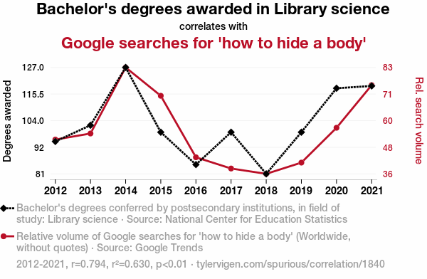

## Was war zuerst da?

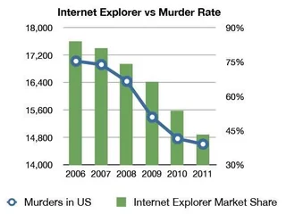

## Grundkonzepte der Korrelation

- **Definition**: Stärke eines Zusammenhangs zwischen Variablen
- **Unterschied zu Kausalität**: Korrelation impliziert keine Ursache-Wirkung-Beziehung

## Von der Kovarianz zur Korrelation

- **Kovarianz**: Unstandartisiertes Maß für gemeinsame Variation
  - Formel: $\text{Cov}(X,Y) = \frac{1}{n-1} \sum_{i=1}^{n} (x_i - \bar{x})(y_i - \bar{y})$
- **Pearson-Korrelation**: Standardisierte Kovarianz
  - Formel: $r = \frac{\text{Cov}(X,Y)}{s_X \cdot s_Y}$
  - Wertebereich: -1 bis +1

## Pearson-Korrelation

- **Voraussetzungen**:

  - Lineare Beziehung
  - Normalverteilung der Variablen (für Hypothesentests)
  - Keine Ausreißer (starker Einfluss auf r)

- **Interpretation der Stärke**:

  - Schwach: \|r\| ≈ 0.1-0.3
  - Mittel: \|r\| ≈ 0.3-0.5
  - Stark: \|r\| \> 0.5

- R-Code: `cor.test(daten$x, daten$y)`

## Visualisierung: Streudiagramm

```{r}
plot(cars)
```

## Durchführung in R

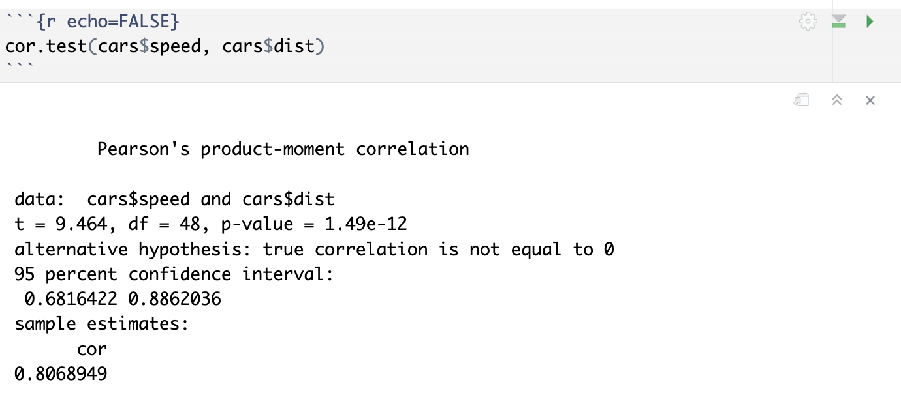

## Alternative Korrelationsmaße

- **Spearman-Rangkorrelation**: Für ordinale Daten oder nicht-lineare monotone Beziehungen
  - Formel: Pearson-Korrelation der rangtransformierten Daten
  - Robuster gegenüber Ausreißern
  - R-Code: `cor.test(daten$x, daten$y, method = "spearman")`

## Alternative Korrelationsmaße

- **Kendall's Tau**: Alternative rangbasierte Korrelation
  - Basiert auf konkordanten vs. diskordanten Paaren
  - Robuster bei kleinen Stichproben
  - R-Code: `cor.test(daten$x, daten$y, method = "kendall")`

## Visualisierung: Korrelationsmatrix

```{r}
# Daten laden
data(mtcars)

# Korrelation berechnen
cor_matrix <- cor(mtcars)

# corrplot laden (ggf. vorher installieren)
library(corrplot)

# Korrelationen visualisieren
corrplot(cor_matrix, method = "circle")
```

## Fallstricke und Fehlinterpretationen

- **Scheinkorrelationen**: Effekt von Drittvariablen
- **Nichtlineare Beziehungen**: Wenn r = 0 trotz starkem Zusammenhang
- **Aggregationsprobleme**: Simpson's Paradoxon
- **Extremwerte und Ausreißer**: Starker Einfluss auf die Korrelation

## Simpson’s Paradoxon: Studienplatzvergabe

| Geschlecht | Bewerbungen | Zugelassen | Annahmequote |
|------------|-------------|------------|--------------|
| Männer     | 1000        | 600        | 60%          |
| Frauen     | 1000        | 500        | 50%          |

## Simpson’s Paradoxon: Studienplatzvergabe

| Fach                   | Geschlecht | Bewerbungen | Zugelassen | Annahmequote |
|------------------------|------------|-------------|------------|--------------|
| **Fach A (leicht)**    | Männer     | 800         | 560        | 70%          |
|                        | Frauen     | 200         | 180        | 90%          |
| **Fach B (schwierig)** | Männer     | 200         | 40         | 20%          |
|                        | Frauen     | 800         | 320        | 40%          |

## Fallbeispiel: Kriminalität in NYC

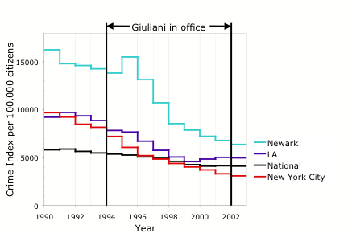

## Wurden die Verbrecher erst gar nicht geboren?

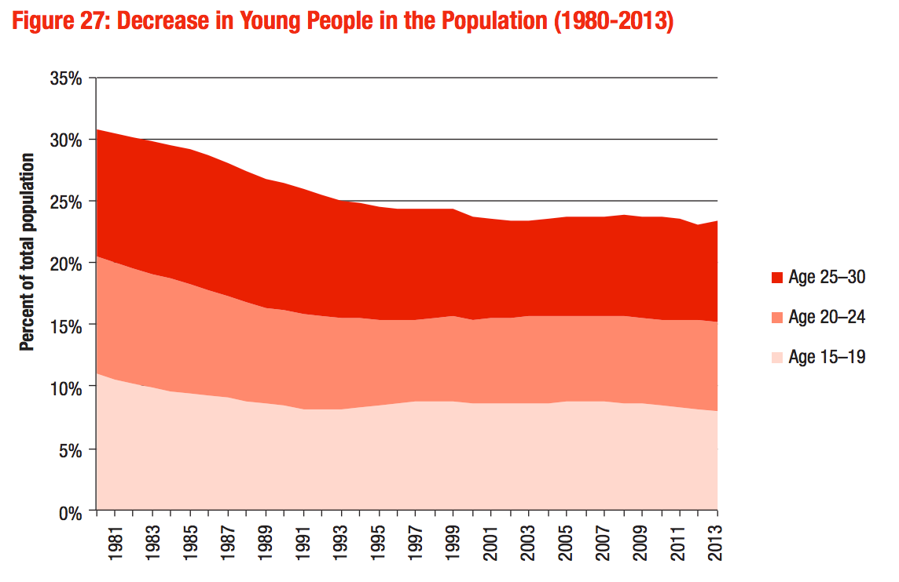

## War es das Blei im Benzin?

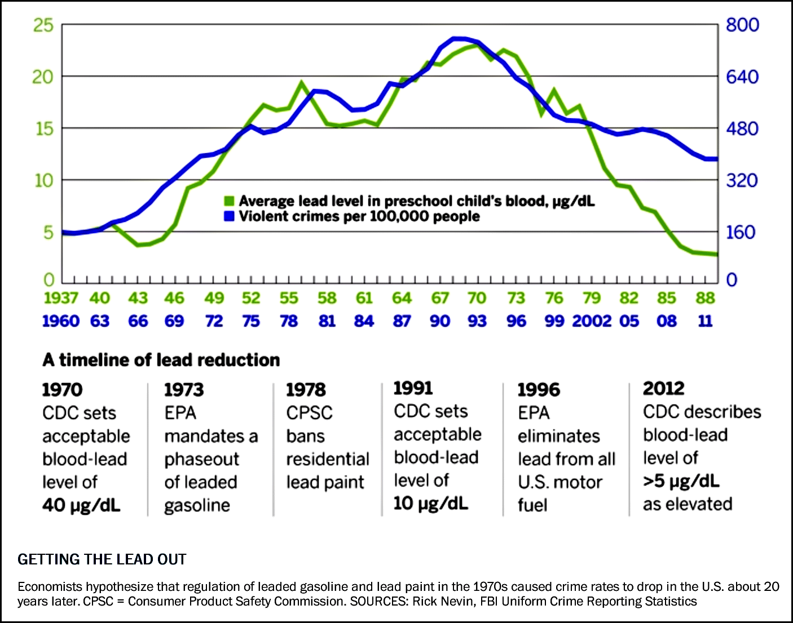

## Was war es denn nun?


## Inter-Rater Reliability

- **Definition**: Konsistenz zwischen verschiedenen Beurteilern

- **Anwendungsbereiche**: Subjektive Bewertungen, medizinische Diagnosen, Content-Analysen

- **Maße für kategoriale Daten**:

  - Cohen's Kappa (zwei Rater)
  - Fleiss' Kappa (mehr als zwei Rater)

- **Maße für kontinuierliche Daten**:

  - Intraclass Correlation Coefficient (ICC)

## Visualisierung: Violinen-Diagramm

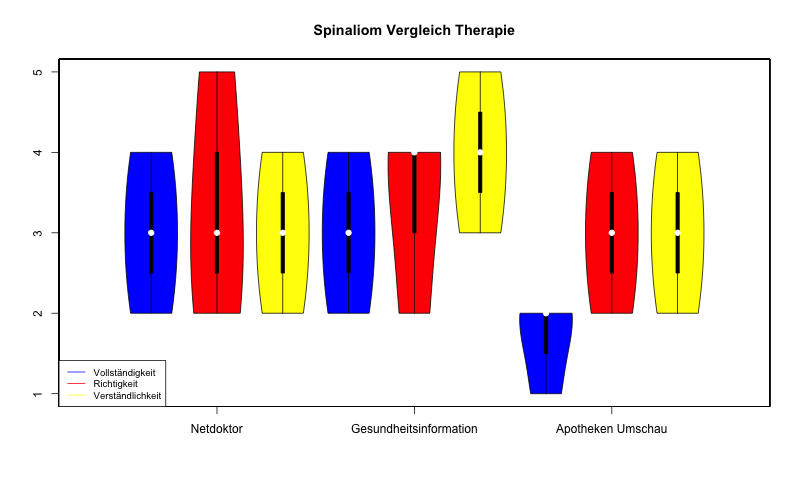

## Wann nutze ich eigentlich was?

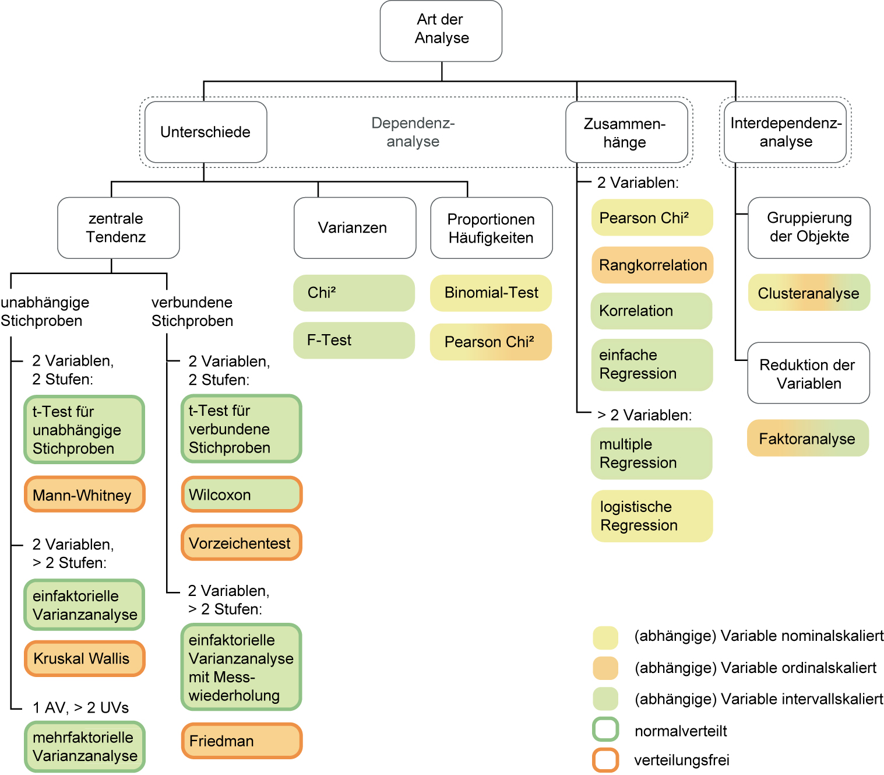


# Sitzung 10: Regression I – Lineare Regression

## Lernziele dieser Sitzung

- Ein lineares Regressionsmodell in R schätzen und interpretieren
- R² und Residuenplots zur Modellbeurteilung nutzen
- Multiple Regression mit kategorialen Prädiktoren anwenden
- Den Unterschied zwischen Korrelation und Regression erklären

------------------------------------------------------------------------

## Einstieg: Wie viel Miete ist zu viel?

Sie wollen nach Berlin ziehen und finden 100 Wohnungsanzeigen. Dort stehen jeweils Wohnfläche (qm) und Miete (Euro). \> \> **Frage:** Kann man aus der Wohnfläche den Mietpreis vorhersagen?

------------------------------------------------------------------------

## Erste Visualisierung: Streudiagramm

```{r}

# Beispiel-Datensatz für Wohnungen erzeugen
wohnungen <- data.frame(
  flaeche = c(30, 45, 60, 70, 80, 90, 100, 110, 120),
  miete = c(450, 600, 720, 850, 1000, 1150, 1250, 1400, 1550)
)

ggplot(wohnungen, aes(x = flaeche, y = miete)) +
  geom_point() +
  #geom_smooth(method = "lm", se = FALSE) +
  theme_minimal()
```

------------------------------------------------------------------------

## Das Modell dahinter: Lineare Regression

$$\hat{Y} = \beta_0 + \beta_1 \cdot X + \varepsilon$$

- $\beta_0$: Startwert (Y bei X = 0)
- $\beta_1$: Steigung (Zunahme von Y bei 1 Einheit mehr X)
- $\varepsilon$: "Fehler" – das, was das Modell nicht erklärt

------------------------------------------------------------------------

```{r message=FALSE}
# Modell berechnen
modell <- lm(miete ~ flaeche, data = wohnungen)

# Vorhergesagte Werte ergänzen
wohnungen$vorhergesagt <- predict(modell)

# Plot mit Residuenlinien
ggplot(wohnungen, aes(x = flaeche, y = miete)) +
  geom_point() +
  geom_smooth(method = "lm", se = FALSE, color = "blue") +
  geom_segment(aes(x = flaeche, xend = flaeche,
                   y = miete, yend = vorhergesagt),
               color = "red") +
  theme_minimal()
```

------------------------------------------------------------------------

## Wie es genau funktioniert


------------------------------------------------------------------------

## Zweite Visualisierung: Streudiagramm mit Regressionslinie

```{r warning=FALSE, message=FALSE}

# Beispiel-Datensatz für Wohnungen erzeugen
wohnungen <- data.frame(
  flaeche = c(30, 45, 60, 70, 80, 90, 100, 110, 120),
  miete = c(450, 600, 720, 850, 1000, 1150, 1250, 1400, 1550)
)

ggplot(wohnungen, aes(x = flaeche, y = miete)) +
  geom_point() +
  geom_smooth(method = "lm", se = FALSE) +
  theme_minimal()
```

------------------------------------------------------------------------

## R-Code zur Modellschätzung

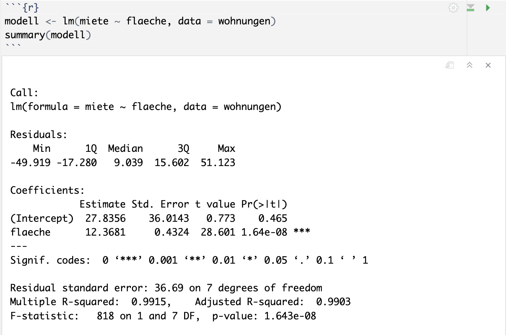

```{r echo=FALSE}
modell <- lm(miete ~ flaeche, data = wohnungen)
```

------------------------------------------------------------------------

## Modellgüte: Wie gut passt die Gerade?

- R² = Anteil der erklärten Varianz
- Beispiel: R² = 0.99 → 99% der Mietunterschiede durch Fläche erklärbar
- Residuenplot prüfen: Gibt es systematische Fehler?

------------------------------------------------------------------------

## Residuenplot - Erwartung: Punkte gleichmäßig um die Nulllinie verteilt

```{r}
ggplot(data.frame(fitted = fitted(modell), residuals = residuals(modell)),
       aes(x = fitted, y = residuals)) +
  geom_point() +
  geom_hline(yintercept = 0, linetype = "dashed", color = "red") +
  theme_minimal()
```

------------------------------------------------------------------------

## Aber ist die Fläche wirklich die einzige unabhängige Variable?

------------------------------------------------------------------------

## Visualisierung der Daten

```{r echo=FALSE, message=FALSE}
Wohnungen_mit_Energieeffizienz <- read_csv("data/Wohnungen_mit_Energieeffizienz.csv")
```

```{r}
ggplot(Wohnungen_mit_Energieeffizienz, aes(x = flaeche, y = miete, color = factor(saniert))) +
  geom_point(alpha = 0.7) +
  labs(color = "Saniert", x = "Fläche (m²)", y = "Miete (€)") +
  theme_minimal()
```

------------------------------------------------------------------------

## Welchen Einfluss hat die Energieeffizienzklasse?

```{r}
ggplot(Wohnungen_mit_Energieeffizienz, aes(x = energieeffizienz, y = miete)) +
  geom_boxplot(fill = "lightblue") +
  labs(x = "Energieeffizienzklasse", y = "Miete (€)") +
  theme_minimal()
```

## Einfluss von Fläche und Energieeffizienz auf Miete

```{r}
ggplot(Wohnungen_mit_Energieeffizienz, aes(x = flaeche, y = miete)) +
  geom_point(alpha = 0.6) +
  facet_wrap(~ energieeffizienz) +
  theme_minimal()
```

## Der Output

```{r}

model <- lm(miete ~ flaeche + saniert + energieeffizienz, data = Wohnungen_mit_Energieeffizienz)
#summary(model)
```

## 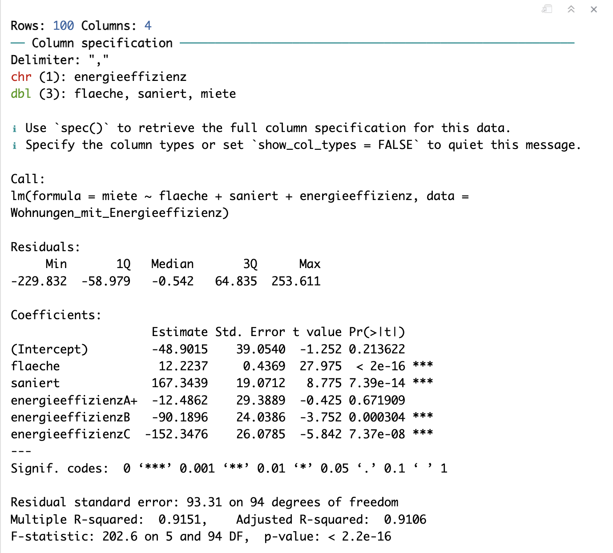

## Wie funktioniert das mit der Linie mit mehr als zwei Variablen?

```{r warning=FALSE}
#install.packages("scatterplot3d")
library(scatterplot3d)
set.seed(42)

wohnungen <- data.frame(
  flaeche = runif(100, 30, 120),
  saniert = sample(0:1, 100, replace = TRUE)
)

# Miete simulieren
wohnungen$miete <- 200 + 10 * wohnungen$flaeche + 150 * wohnungen$saniert + rnorm(100, 0, 100)

# Modell wie gehabt
modell <- lm(miete ~ flaeche + saniert, data = wohnungen)

# 3D-Scatterplot
s3d <- scatterplot3d(wohnungen$flaeche, wohnungen$saniert, wohnungen$miete,
                     xlab = "Fläche (qm)",
                     ylab = "Saniert (0 = nein, 1 = ja)",
                     zlab = "Miete (€)",
                     pch = 16,
                     color = "blue",
                     angle = 55,
                     main = "Lineare Regression mit drei Variablen")

# Regressionsfläche berechnen
gitter <- expand.grid(
  flaeche = seq(min(wohnungen$flaeche), max(wohnungen$flaeche), length.out = 2),
  saniert = c(0, 1)
)
gitter$miete <- predict(modell, newdata = gitter)

# Regressionsfläche als Linien zeichnen
s3d$plane3d(modell, draw_polygon = TRUE, polygon_args = list(col = rgb(0.1, 0.5, 0.1, 0.3)))
```

------------------------------------------------------------------------

# Sitzung 13: Regression II – Logistische Regression

## Lernziele dieser Sitzung

- Das Konzept der Log-Odds und der Logit-Transformation erklären
- Eine logistische Regression in R schätzen und interpretieren
- Odds Ratios berechnen und kommunizieren
- Die S-Kurve und ihre Bedeutung verstehen
- Lineare und logistische Regression gegenüberstellen

------------------------------------------------------------------------

## Jetzt wird's binär: Logistische Regression

Frage: Stirbt ein Titanic-Passagier oder nicht? Und welche Faktoren führen dazu?

## Was sind Log-Odds?

In der logistischen Regression wird **nicht direkt die Wahrscheinlichkeit** geschätzt, sondern:

$$\log\left(\frac{p}{1 - p}\right)$$

Das ist der sogenannte **Logit** – also der **logarithmierte Quotient der Wahrscheinlichkeit und ihrer Gegenwahrscheinlichkeit**.

--

## Was ist ein Logarithmus?

- Der **Logarithmus** ist die Umkehrung der Potenzierung:

$$  \log_{10}(1000) = 3 \quad \text{denn } 10^3 = 1000$$

------------------------------------------------------------------------

### Merksatz:

> Der Logarithmus transformiert Werte in ein **lineares Maß**, das für Regressionsmodelle besser handhabbar ist – auch wenn die ursprünglichen Wahrscheinlichkeiten zwischen 0 und 1 liegen.

------------------------------------------------------------------------

## Warum Log-Odds?

- Wahrscheinlichkeiten liegen **zwischen 0 und 1**

- Log-Odds hingegen können **alle Werte zwischen –∞ und +∞** annehmen

- So kann ein **lineares Modell** verwendet werden:

  $$\log\left(\frac{p}{1 - p}\right) = \beta_0 + \beta_1 x_1 + \dots + \beta_k x_k $$

------------------------------------------------------------------------

## Beispiel:

| Wahrscheinlichkeit (p) | Gegenwahrscheinlichkeit (1 - p) | Verhältnis (Odds) (p : (1 - p)) | | Odds (als Zahl) ($\frac{p}{1-p}$) | Log-Odds ($\log\left(\frac{p}{1-p}\right)$) |
|---------------|---------------|---------------|---------------|---------------|
| 0.10 | 0.90 | 1 : 9 | 0.111 | –2.20 |
| 0.50 | 0.50 | 1 : 1 | 1.000 | 0.00 |
| 0.90 | 0.10 | 9 : 1 | 9.000 | 2.20 |

------------------------------------------------------------------------

## Merksatz:

**Log-Odds** sind eine **Umformung der Wahrscheinlichkeit** und erlauben **lineare Modellierung** auf einer unbeschränkten Skala.

------------------------------------------------------------------------

```{r echo=FALSE}
# Installieren falls nötig
#install.packages("titanic")
library(titanic)
data("titanic_train")
```

## Zunächst müssen wir die Daten vorbereiten

```{r echo=TRUE}
titanic <- titanic_train %>%
  select(Survived, Pclass, Sex, Age) %>%
  filter(!is.na(Age)) %>%
  mutate(
    Survived = factor(Survived, labels = c("Gestorben", "Überlebt")),
    Sex = factor(Sex),
    Pclass = factor(Pclass)
  )
```

## Der Output

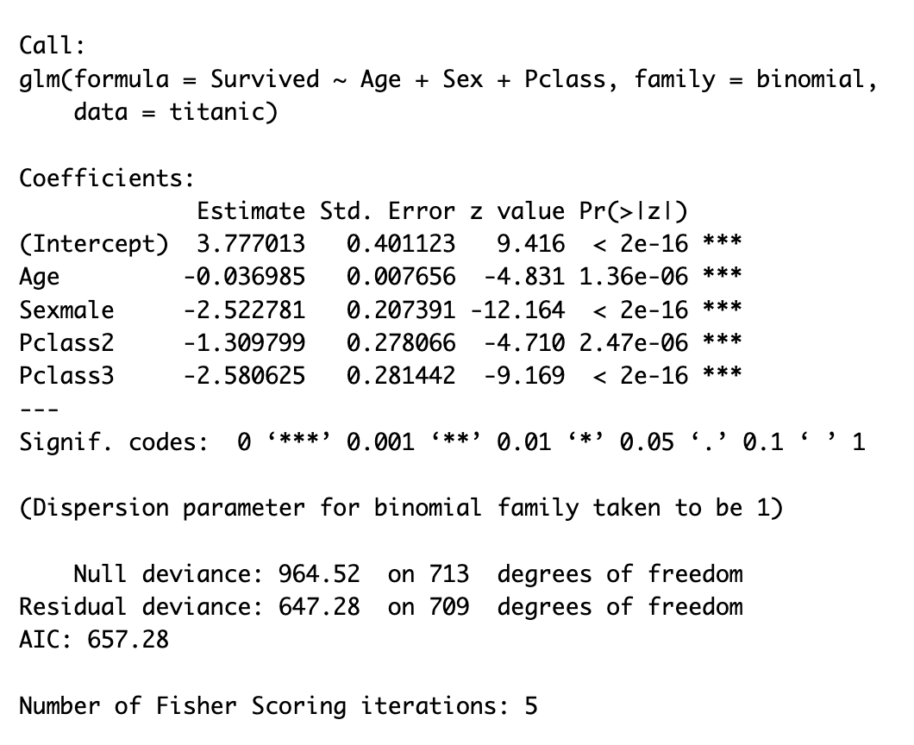

```{r}
model <- glm(Survived ~ Age + Sex + Pclass, data = titanic, family = binomial)
# summary(model)
```

## Ausgabe der LogOdds

```{r echo=FALSE, message=FALSE, warning=FALSE}
#exp(coef(model))
```

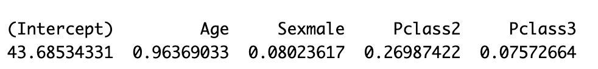

------------------------------------------------------------------------

## S-Kurve

```{r}
library(titanic)
library(ggplot2)
library(dplyr)

data("titanic_train")

# Daten vorbereiten
titanic <- titanic_train %>%
  select(Survived, Age) %>%
  filter(!is.na(Age)) %>%
  mutate(Survived = factor(Survived, labels = c("Gestorben", "Überlebt")))

ggplot(titanic, aes(x = Age, y = as.numeric(Survived == "Überlebt"))) +
  geom_point(alpha = 0.2, position = position_jitter(height = 0.05)) +
  stat_smooth(method = "glm", method.args = list(family = "binomial"), se = FALSE) +
  labs(x = "Alter", y = "Wahrscheinlichkeit zu überleben",
       title = "S-Kurve: Überlebenswahrscheinlichkeit nach Alter") +
  theme_minimal()
```

## S-Kurve II

```{r}
titanic <- titanic_train %>%
  select(Survived, Age, Sex) %>%
  filter(!is.na(Age)) %>%
  mutate(Survived = factor(Survived, labels = c("Gestorben", "Überlebt")))

ggplot(titanic, aes(x = Age, y = as.numeric(Survived == "Überlebt"), color = Sex)) +
  stat_smooth(method = "glm", method.args = list(family = "binomial"), se = FALSE) +
  labs(title = "S-Kurve: Überleben nach Alter und Geschlecht", y = "Wahrscheinlichkeit zu überleben") +
  theme_minimal()
```

------------------------------------------------------------------------

## Vergleich: Lineare vs. Logistische Regression

| Aspekt         | Lineare Regression    | Logistische Regression         |
|----------------|-----------------------|--------------------------------|
| Zielvariable Y | metrisch (z.B. Preis) | binär (z.B. gestorben ja/nein) |
| Ergebnis       | Gerade                | S-Kurve                        |
| Vorhersage     | Reeller Zahlenwert    | Wahrscheinlichkeit (0–1)       |
| Residuen       | Differenz             | Abweichung in Log-Odds         |
| Interpretation | Effekt pro X          | Odds Ratio                     |

------------------------------------------------------------------------

## Unterschied Korrelation zu Regression

- **Korrelation** beschreibt **Stärke und Richtung** eines **linearen Zusammenhangs** zwischen zwei numerischen Variablen, ohne Einflussrichtung oder Kausalität anzunehmen.

- **Lineare Regression** modelliert eine **gerichtete lineare Beziehung** zwischen einer abhängigen Variable und einer oder mehreren unabhängigen Variablen mit der **Stärke des Einflusses**.

------------------------------------------------------------------------

## Unterschied Korrelation zu Regression

- **Logistische Regression** schätzt die **Wahrscheinlichkeit** für das Eintreten eines **binären Ereignisses** auf Basis einer oder mehrerer Einflussvariablen und liefert eine **gerichtete Interpretation**.

------------------------------------------------------------------------

# Sitzung 11: ANOVA

## Lernziele dieser Sitzung

- ANOVA als Erweiterung des t-Tests auf mehr als zwei Gruppen einordnen
- Varianzzerlegung und F-Statistik verstehen
- Eine einfaktorielle ANOVA in R durchführen
- Post-hoc-Tests (Tukey HSD) korrekt einsetzen
- Den passenden Test für den eigenen Datensatz wählen

## Was ist ANOVA?

- ANOVA = Analysis of Variance = Varianzanalyse
- Prüft, ob sich Gruppenmittelwerte signifikant unterscheiden
- Erweiterung des t-Tests auf mehr als zwei Gruppen
- Beispiel: Unterschiedet sich die durchschnittliche Miete in verschiedenen Stadtteilen?

------------------------------------------------------------------------

## Wann nutzt man ANOVA?

- Abhängige Variable metrisch (z.B. Einkommen, Preis, Größe)
- Unabhängige Variable kategorial (z.B. Stadtteil, Behandlungsmethode)
- Mehr als zwei Gruppen zu vergleichen
- Ziel: Test auf Mittelwertsunterschiede

------------------------------------------------------------------------

## Grundidee der ANOVA

- Zerlegung der Gesamtvarianz:
  - **Zwischen-Gruppen-Varianz**: Unterschiede zwischen den Gruppenmitteln
  - **Innerhalb-Gruppen-Varianz**: Streuung innerhalb der Gruppen
- Wenn die Zwischen-Gruppen-Varianz groß im Vergleich zur Innerhalb-Gruppen-Varianz ist → Hinweis auf echte Unterschiede

------------------------------------------------------------------------

## Beispiel: Schmerzmittel-Wirkung

- Fragestellung: Unterscheidet sich die durchschnittliche Schmerzreduktion bei drei Medikamenten?
- Gruppen:
  - Medikament A
  - Medikament B
  - Placebo
- Abhängige Variable: Schmerzscore nach 30 Minuten (Skala 0-10)
- ANOVA prüft, ob es signifikante Unterschiede gibt

------------------------------------------------------------------------

## Beispiel: Werbewirkung testen

- Fragestellung: Führt die Art der Werbeanzeige zu unterschiedlichen Kaufabsichten?
- Gruppen:
  - Emotionaler Spot
  - Sachlicher Spot
  - Keine Werbung (Kontrollgruppe)
- Abhängige Variable: Kaufwahrscheinlichkeit (Skala 0-100%)
- ANOVA zeigt, ob mindestens eine Gruppe signifikant abweicht

------------------------------------------------------------------------

## Beispiel: Einfluss von Dünger

- Fragestellung: Hat die Düngersorte Einfluss auf das Pflanzenwachstum?
- Gruppen:
  - Dünger X
  - Dünger Y
  - Kein Dünger
- Abhängige Variable: Pflanzenhöhe nach 6 Wochen (in cm)
- ANOVA prüft auf Unterschiede der mittleren Pflanzenhöhe

------------------------------------------------------------------------

## Hypothesen der ANOVA

- **Nullhypothese (H₀)**: Alle Gruppenmittelwerte sind gleich
- **Alternativhypothese (H₁)**: Mindestens zwei Gruppen unterscheiden sich im Mittelwert

------------------------------------------------------------------------

## Beispiel in R

```{r echo=FALSE}
# Beispiel-Datensatz
set.seed(123)
data <- data.frame(
  gruppe = rep(c("A", "B", "C"), each = 20),
  wert = c(rnorm(20, mean = 5), rnorm(20, mean = 7), rnorm(20, mean = 6))
)
```

```{r}
# ANOVA durchführen
anova_mod <- aov(wert ~ gruppe, data = data)
summary(anova_mod)
```

------------------------------------------------------------------------

## Interpretation der Ausgabe

- **F-Wert**: Teststatistik, je größer desto mehr Hinweis auf Unterschied
- **p-Wert**: Ist p \< 0.05 → Ablehnung der Nullhypothese
- Achtung: ANOVA zeigt nur, *dass* ein Unterschied vorliegt, nicht *wo* genau

------------------------------------------------------------------------

## Post-hoc-Tests

- Notwendig, wenn ANOVA signifikant ist
- Beispiele:
  - Tukey HSD-Test (bei Varianzhomogenität)
  - Games-Howell-Test (bei ungleichen Varianzen)
- Zeigt, zwischen welchen Gruppen die Unterschiede liegen

------------------------------------------------------------------------

## Der Levene-Test

```{r warning=FALSE}
car::leveneTest(wert ~ gruppe, data = data)
```

## Tukey HSD-Test

```{r echo=FALSE}
# TukeyHSD(anova_mod)
```

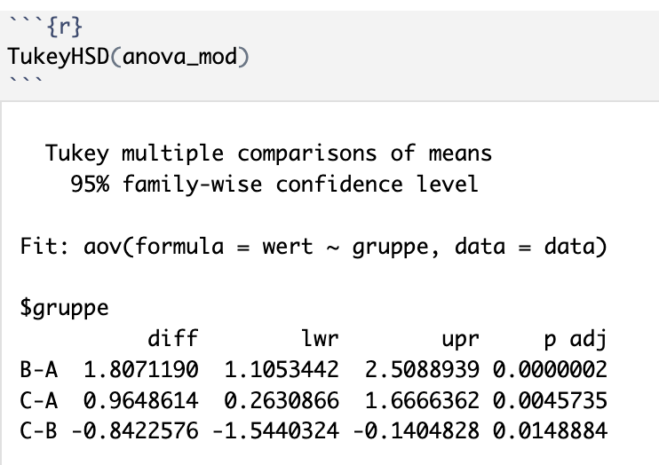

## Ergebnisse visualisieren

```{r}
plot(TukeyHSD(anova_mod))
```

## Voraussetzungen der ANOVA

- Unabhängigkeit der Beobachtungen
- Normalverteilung innerhalb der Gruppen
- Varianzhomogenität (Levene-Test prüfen)
- Robustheit bei kleinen Abweichungen gegeben

------------------------------------------------------------------------

## Was tun, wenn Voraussetzungen verletzt sind? Nicht-parametrische Tests

| Parametrisch | Nicht-parametrische Alternative | Wann? |
|------------------------|------------------------|------------------------|
| t-Test (unabh.) | Mann-Whitney-U-Test | Keine Normalverteilung, kleine n |
| t-Test (gepaart) | Wilcoxon-Vorzeichen-Rang-Test | Verbundene Stichproben, ordinal |
| ANOVA | Kruskal-Wallis-Test | Mehr als 2 Gruppen, keine Normalverteilung |

``` r
# Beispiele
wilcox.test(x, y)                          # Mann-Whitney-U
wilcox.test(before, after, paired = TRUE)  # Wilcoxon gepaart
kruskal.test(wert ~ gruppe, data = data)   # Kruskal-Wallis
```

------------------------------------------------------------------------

## Visualisierung von Gruppenunterschieden

- Boxplots
- Violinplots
- Balkendiagramme mit Fehlerbalken
- Plot der Mittelwerte pro Gruppe

## Überblick: Welcher Test wofür?

| Test | Abhängige Variable | Unabhängige Variable | Zweck |
|------------------|------------------|------------------|------------------|
| **t-Test** | Metrisch | Kategorial (2 Gruppen) | Mittelwertsunterschied zwischen 2 Gruppen |
| **Chi-Quadrat-Test** | Kategorial | Kategorial | Zusammenhang oder Verteilung bei Kategorien |
| **Korrelation** | Metrisch | Metrisch | Zusammenhang/Stärke zwischen zwei Variablen |
| **ANOVA** | Metrisch | Kategorial (\>2 Gruppen) | Mittelwertsunterschiede zwischen Gruppen |
| **Lineare Regression** | Metrisch | Metrisch oder kategorial | Einfluss mehrerer Variablen auf metrisches Ergebnis |
| **Logistische Regression** | Binär (0/1) | Metrisch oder kategorial | Einfluss auf Wahrscheinlichkeit (z.B. Krankheit ja/nein) |

------------------------------------------------------------------------

# Sitzung 12: Text Mining

## Lernziele dieser Sitzung

- Textdaten für eine statistische Analyse aufbereiten
- Das Bayes'sche Theorem erklären und anwenden
- Einen Naive-Bayes-Klassifikator in R trainieren und evaluieren
- Modellgüte mit Confusion Matrix, Precision, Recall und AUC beurteilen

------------------------------------------------------------------------

## Spam oder Ham?

- Unerwünschte Werbe-E-Mails = Spam
- Begriff stammt aus...?
- Ziel: Automatische Erkennung von Spam-Mails
- Klassisches Beispiel für Textklassifikation in der Datenanalyse

------------------------------------------------------------------------

## Bayes'sches Theorem: Grundkonzept

- **Definition:** $P(A|B) = \frac{P(B|A) \times P(A)}{P(B)}$
- **Bedeutung der Komponenten:**
  - P(A\|B): Wahrscheinlichkeit von A, gegeben B (posteriori)
  - P(B\|A): Wahrscheinlichkeit von B, gegeben A (Likelihood)
  - P(A): Wahrscheinlichkeit von A ohne weitere Information (a priori)
  - P(B): Wahrscheinlichkeit von B, Normalisierungsfaktor
- **Einfach ausgedrückt:** Aktualisierung von Wahrscheinlichkeiten basierend auf neuen Informationen

------------------------------------------------------------------------

## Zwei Denkansätze am Beispiel einer Handysuche

- **Ausgangssituation:**
  - Handy ist verloren
  - Könnte irgendwo im Haus sein
  - Begrenzte Zeit zum Suchen
  - Wie gehen wir vor?

------------------------------------------------------------------------

## Der frequentistische Ansatz

- **Gleichverteilte Aufmerksamkeit** für alle Orte
- **Systematische, methodische Suche** des gesamten Hauses
- **Ignoriert persönliche Erfahrungen** und Gewohnheiten
- **Unveränderter Suchplan**, unabhängig von Zwischenergebnissen
- **Fragestellung:** "Wie wahrscheinlich ist es, das Handy zu finden, wenn ich hier suche?"

------------------------------------------------------------------------

## Der bayesianische Ansatz

- Beginnt mit **Vorwissen als Prior** ("Wo verliere ich normalerweise Dinge?")
- **Priorisiert wahrscheinliche Orte** (Sofa, Schreibtisch, Jacke)
- **Aktualisiert kontinuierlich** die Suchstrategie basierend auf neuen Hinweisen
- **Integriert subjektive Wahrscheinlichkeiten**
- **Fragestellung:** "Wo ist das Handy am wahrscheinlichsten, gegeben was ich bereits weiß?"

------------------------------------------------------------------------

## Vergleich der Ansätze

| Frequentistisch                         | Bayesianisch                |
|-----------------------------------------|-----------------------------|
| Objektiv                                | Subjektiv                   |
| Statisch                                | Adaptiv                     |
| Gleichverteilte Aufmerksamkeit          | Priorisierte Aufmerksamkeit |
| Berücksichtigt keine Erfahrung          | Nutzt Vorwissen             |
| Methodisch                              | Opportunistisch             |
| Keine Wahrscheinlichkeitsaktualisierung | Kontinuierliches Lernen     |

------------------------------------------------------------------------

## Bayes'sches Theorem angewandt auf Spam

- **Wir wollen wissen: P(Spam\|Wörter)**
  - Die Wahrscheinlichkeit, dass eine E-Mail Spam ist, gegeben die enthaltenen Wörter
- **Nach Bayes:**
  - P(Spam\|Wörter) = (P(Wörter\|Spam) × P(Spam)) / P(Wörter)
  - **P(Spam)**: A-priori-Wahrscheinlichkeit für Spam (z.B. 40% aller E-Mails)
  - **P(Wörter\|Spam)**: Wahrscheinlichkeit dieser Wörter in Spam-Mails
  - **P(Wörter)**: Wahrscheinlichkeit dieser Wörter in allen E-Mails

------------------------------------------------------------------------

## Die "Naive" Annahme

- **Bei Naive Bayes nehmen wir an, dass alle Wörter unabhängig voneinander auftreten:**
  - P(Wörter\|Spam) = P(Wort₁\|Spam) × P(Wort₂\|Spam) × ... × P(Wortₙ\|Spam)
- **Beispiel**: "Viagra" und "Rabatt" in einer E-Mail
  - In Realität: Diese Wörter treten häufig gemeinsam auf
  - Naive Annahme: Behandlung als unabhängige Ereignisse
  - Trotz dieser Vereinfachung: Überraschend gute Ergebnisse!

------------------------------------------------------------------------

## Wie funktioniert Naive Bayes bei Spam?

- **1. Training:**
  - Sammeln von bekannten Spam- und Ham-E-Mails (Trainingskorpus)
  - Zählen der Worthäufigkeiten in beiden Kategorien
  - Berechnen von P(Wort\|Spam) und P(Wort\|Ham) für alle Wörter
  - Ermitteln von P(Spam) und P(Ham) aus dem Trainingskorpus
- **2. Klassifikation:**
  - Berechnen von P(Spam\|E-Mail) und P(Ham\|E-Mail) für neue E-Mail
  - Klassifizieren basierend auf der höheren Wahrscheinlichkeit

------------------------------------------------------------------------

## Datengrundlage

- E-Mail-Datensatz `emails.csv`
- Enthält Text der E-Mails und Spam-Kennzeichnung
- Häufigkeit von Spam und Ham
- Class Imbalance beachten

------------------------------------------------------------------------

## Textaufbereitung (Text Mining)

- Nutzung der Pakete `tm` und `SnowballC`
- Schritte:
  - Umwandlung in Kleinschreibung
  - Entfernen von Satzzeichen
  - Entfernen von Stoppwörtern ("the", "and" ...)
  - Wortstamm-Reduktion (Stemming)

Ziel: Standardisierung und Reduktion der Textvielfalt

------------------------------------------------------------------------

## Document-Term-Matrix (DTM)

- Erstellung einer DTM zur quantitativen Darstellung der Texte
- Zeilen = E-Mails, Spalten = Wörter
- Zellinhalt: Häufigkeit des Wortes pro E-Mail

------------------------------------------------------------------------

## Reduktion auf häufige Begriffe

- Entfernen seltener Wörter mit `removeSparseTerms`
- Fokus auf die aussagekräftigsten Begriffe

------------------------------------------------------------------------

## Vorbereitung für das Modell

- Umwandlung der DTM in Data Frame
- Umbenennung der Spaltennamen
- Zielvariable `spam` als Faktor kodiert

------------------------------------------------------------------------

## Trainings- und Testdaten

- Aufteilung in Trainings- (80%) und Testdaten (20%)
- Nutzung von `caret`-Paket

------------------------------------------------------------------------

## Vorhersage und Bewertung

- Klassifikation der Testdaten
- Vergleich mit tatsächlichen Spam-Labels

## Die Confusion Matrix

|                          | Tatsächlich Positiv  | Tatsächlich Negativ  |
|--------------------------|----------------------|----------------------|
| **Vorhergesagt Positiv** | True Positives (TP)  | False Positives (FP) |
| **Vorhergesagt Negativ** | False Negatives (FN) | True Negatives (TN)  |

------------------------------------------------------------------------

## Die Confusion Matrix: Beispiel Spam-Filter

- **TP**: Korrekt als Spam erkannte E-Mails
- **FP**: Fälschlicherweise als Spam markierte normale E-Mails
- **FN**: Nicht erkannter Spam (als normal klassifiziert)
- **TN**: Korrekt als normal erkannte E-Mails

------------------------------------------------------------------------

## Fehler 1. und 2. Art

- **Fehler 1. Art (Alpha-Fehler):**
  - Zurückweisung einer wahren Nullhypothese
  - "Falscher Alarm" / False Positive
- **Fehler 2. Art (Beta-Fehler):**
  - Nichtablehnung einer falschen Nullhypothese
  - "Verpasster Treffer" / False Negative
- **Zusammenhang:**
  - Meist gegensätzliche Beziehung (Trade-off)
  - Verringerung des einen Fehlers erhöht oft den anderen

------------------------------------------------------------------------

## Grundlegende Metriken aus der Confusion Matrix

- **Accuracy (Genauigkeit):**
  - (TP + TN) / (TP + TN + FP + FN)
  - Anteil korrekt klassifizierter Instanzen
  - Problem: Irreführend bei unausgewogenen Klassen
- **Error Rate (Fehlerrate):**
  - (FP + FN) / (TP + TN + FP + FN)
  - Anteil falsch klassifizierter Instanzen

------------------------------------------------------------------------

## Precision und Recall

- **Precision (Präzision, Genauigkeit):**
  - TP / (TP + FP)
  - "Von allen als positiv vorhergesagten, wie viele sind tatsächlich positiv?"
  - Fokus auf falsche Positive (Fehler 1. Art)
  - Beispiel: Von allen als Spam markierten E-Mails, wie viele sind wirklich Spam?

------------------------------------------------------------------------

## Precision und Recall

- **Recall (Sensitivität, Trefferquote):**
  - TP / (TP + FN)
  - "Von allen tatsächlich positiven, wie viele wurden korrekt erkannt?"
  - Fokus auf falsche Negative (Fehler 2. Art)
  - Beispiel: Von allen Spam-E-Mails, wie viele werden erkannt?

------------------------------------------------------------------------

## ROC-Kurve und AUC

- Bewertung der Modellgüte über die ROC-Kurve
- AUC (Area Under Curve) als Maß für die Trennschärfe
- Zusätzliche Visualisierung von Konfidenzintervallen möglich

## ROC-Kurve und AUC

::::: columns
::: {.column width="70%"}
- ROC-Kurve (Receiver Operating Characteristic)
  - Trade-off: True Positive Rate vs. False Positive Rate
  - Interpretation: näher an linker oberer Ecke = besser
- Area Under the Curve
  - Fläche unter ROC-Kurve (0.5 bis 1.0)
:::

::: {.column width="30%"}
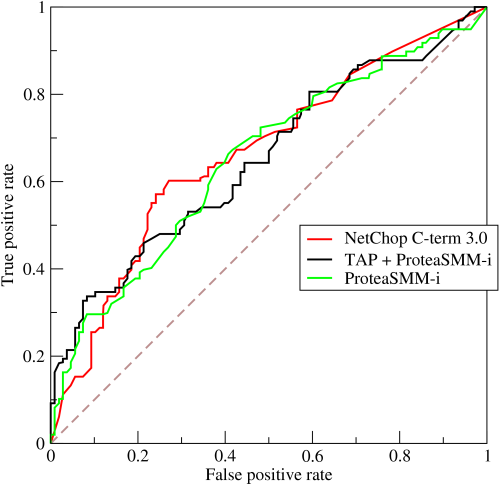
:::
:::::

------------------------------------------------------------------------

## Precision-Recall Kurve

- **Alternative zur ROC-Kurve:**
  - Precision gegen Recall für verschiedene Schwellenwerte
- **Wann verwenden:**
  - Bei unausgewogenen Datensätzen
  - Fokus auf positive Klasse
- **Interpretation:**
  - Besser: näher an oberer rechter Ecke

------------------------------------------------------------------------

## Overfitting vs. Underfitting

- **Overfitting:**
  - Zu genaues Lernen (inkl. Rauschen)
  - Gut im Training, schlecht im Test
- **Underfitting:**
  - Zu einfaches Modell
  - Schlecht in Training und Test
- **Balance durch:**
  - Regularisierung
  - Angemessene Modellkomplexität

------------------------------------------------------------------------

## Nächste Schritte

- Weitere Klassifikatoren testen (z.B. Entscheidungsbäume, SVM)
- Optimierung der Textaufbereitung
- Einsatz von Word Embeddings für fortgeschrittene Modelle

# Sitzung 14: Abschluss

## Lernziele dieser Sitzung

- Den gesamten Kurs strukturiert rekapitulieren
- Den richtigen Test für eine gegebene Forschungsfrage auswählen
- Ergebnisse korrekt berichten (APA-Style)

## Der rote Faden: Von der Frage zur Methode


## Alle Tests auf einen Blick

| Test | Abhängige Variable | Unabhängige Variable | Zweck |
|------------------|------------------|------------------|------------------|
| **t-Test** | Metrisch | Kategorial (2 Gruppen) | Mittelwertsvergleich |
| **Chi-Quadrat** | Kategorial | Kategorial | Häufigkeiten / Zusammenhang |
| **Korrelation** | Metrisch | Metrisch | Stärke des Zusammenhangs |
| **ANOVA** | Metrisch | Kategorial (\>2 Gruppen) | Mittelwertsvergleich |
| **Lin. Regression** | Metrisch | Metrisch / kategorial | Einfluss & Vorhersage |
| **Log. Regression** | Binär (0/1) | Metrisch / kategorial | Wahrscheinlichkeit |
| **Mann-Whitney-U** | Ordinal / metrisch | Kategorial (2 Gruppen) | Wie t-Test, nicht-parametrisch |
| **Kruskal-Wallis** | Ordinal / metrisch | Kategorial (\>2 Gruppen) | Wie ANOVA, nicht-parametrisch |

## Ergebnisse korrekt berichten

- **Immer angeben**: Teststatistik, Freiheitsgrade, p-Wert, Effektgröße
- **t-Test**: *t*(28) = 2.45, *p* = .02, *d* = 0.89
- **Chi-Quadrat**: χ²(2) = 8.24, *p* = .016, Cramér's V = .23
- **Korrelation**: *r*(98) = .54, *p* \< .001
- **ANOVA**: *F*(2, 57) = 4.32, *p* = .018, η² = .13

## Häufige Fehler in Bachelorarbeiten

- p-Wert ohne Effektgröße berichten
- Korrelation als Kausalität interpretieren
- Voraussetzungen nicht geprüft (Normalverteilung, Varianzhomogenität)
- Signifikanz mit Relevanz gleichsetzen
- Fehlende Werte ignorieren statt transparent machen
- Daten nach dem Schauen anpassen (p-Hacking)

## Ein Wort zur Replikationskrise

- Viele publizierte Studien lassen sich nicht replizieren
- Ursachen: p-Hacking, kleine Stichproben, Publication Bias
- **Konsequenz für Ihre Arbeit**: Transparenz über Methoden, Voraussetzungsprüfung, Effektgrößen angeben
- Vorregistrierung als Gold-Standard (für BA-Arbeiten optional, aber bekannt sein)

## Stichprobengröße: Wie viele brauche ich?

- Zu kleine Stichproben → zu wenig Power → echte Effekte werden übersehen
- Faustregel für Abschlussarbeiten: n ≥ 30 pro Gruppe (besser: Poweranalyse)
- Power-Analyse in R:

``` r
library(pwr)
# Beispiel: t-Test, mittlerer Effekt (d=0.5), Power=0.80, α=0.05
pwr.t.test(d = 0.5, sig.level = 0.05, power = 0.80, type = "two.sample")
```

## Fehlende Werte – kein Tabuthema

- Immer dokumentieren: Wie viele NAs? In welchen Variablen?
- Strategien:
  - Komplette Beobachtungen (`na.omit()`) – einfach, aber Datenverlust
  - Mittelwert-/Medianimputation – nur für MAR-Mechanismus
  - Multiple Imputation (`mice`-Paket) – Best Practice
- **Niemals**: NAs stillschweigend ignorieren

## Viel Erfolg!


# Sitzung 9: Einfache Lineare Regression

## Von der Korrelation zur Regression

- **Unterschied**: Korrelation beschreibt Zusammenhang, Regression ermöglicht Vorhersagen
- **Abhängige vs. unabhängige Variable**: Y als Funktion von X
- **Lineare Beziehung**: Modellierung durch eine Gerade

## Das lineare Regressionsmodell

- **Grundgleichung**: $Y = \beta_0 + \beta_1 X + \varepsilon$
- **Parameter**:
  - Achsenabschnitt (Intercept) $\beta_0$: Wert von Y, wenn X = 0
  - Steigung (Slope) $\beta_1$: Änderung in Y bei Erhöhung von X um eine Einheit
  - Fehlerterm $\varepsilon$: Zufällige Abweichung (normalverteilt mit Mittelwert 0)
- **Kleinstquadrateschätzung**: Minimierung der quadrierten Residuen

## Durchführung in R

- **Einfache lineare Regression**:

  # Modell erstellen

  model \<- lm(y \~ x, data = daten)

  # Zusammenfassung anzeigen

  summary(model)

  # Diagnostische Plots

  par(mfrow = c(2, 2)) plot(model)

## Interpretation der Ergebnisse

- **Regressionskoeffizienten**: Bedeutung von Intercept und Slope
- **Standardfehler der Koeffizienten**: Präzision der Schätzung
- **t-Werte und p-Werte**: Signifikanz der Koeffizienten
- **R²**: Erklärte Varianz bzw. Bestimmtheitsmaß
  - Interpretation: Anteil der Varianz in Y, der durch X erklärt wird
  - Adjustiertes R²: Korrektur für die Anzahl der Prädiktoren

## Voraussetzungen und Diagnostik

- **Linearität**: Beziehung sollte linear sein
- **Normalverteilung der Residuen**: QQ-Plot zur Überprüfung
- **Homoskedastizität**: Konstante Varianz der Residuen
- **Unabhängigkeit der Beobachtungen**: Keine Autokorrelation
- **Ausreißer und einflussreiche Beobachtungen**: Cook's Distance, Leverage

## Visualisierung von Regressionsmodellen

- **Streudiagramm mit Regressionslinie**:

  library(ggplot2) ggplot(daten, aes(x = x, y = y)) + geom_point() + geom_smooth(method = "lm", se = TRUE) + theme_minimal() + labs(title = "Lineare Regression", subtitle = paste("R² =", round(summary(model)\$r.squared, 3)))

- **Residuenplots**:

  # Residuen gegen vorhergesagte Werte

  ggplot(data.frame(fitted = fitted(model), residuals = residuals(model)), aes(x = fitted, y = residuals)) + geom_point() + geom_hline(yintercept = 0, linetype = "dashed", color = "red") + theme_minimal() + labs(title = "Residuen vs. vorhergesagte Werte")

## Praktische Anwendungsbeispiele

- **Fairer Preis für gebrauchte Artikel**: Preisvorhersage basierend auf Alter, Zustand, etc.
- **Verkaufsprognosen**: Vorhersage des Umsatzes basierend auf Werbeausgaben
- **Biometrische Zusammenhänge**: z.B. Zusammenhang zwischen Größe und Gewicht

## Transformation nicht-linearer Beziehungen

- **Logarithmische Transformation**: Für exponentielle Beziehungen

- **Quadratische Transformation**: Für U-förmige Beziehungen

- **Box-Cox-Transformation**: Systematische Suche nach optimaler Transformation

- **Beispiel in R**:

  \`\`\` r \# Log-Transformation model_log \<- lm(log(y) \~ x, data = daten)

  # Quadratische Transformation

  model_quad \<- lm(y \~ x + I(x\^2), data = daten)

  # Vergleich der Modelle mittels AIC

  AIC(model, model_log, model_quad)


# Sitzung 10: Logistische Regression

## Was ist die logistische Regression?

- **Unterschied zur linearen Regression**: Binäre abhängige Variable
- **Logit-Funktion**: Transformation von Wahrscheinlichkeiten in Log-Odds
- **Grundgleichung**: $\log\left(\frac{p}{1-p}\right) = \beta_0 + \beta_1 X$
- **Interpretation**: Odds Ratios statt direkter Effekte

## Durchführung der logistischen Regression in R

- **Modellschätzung**:

``` r
  # Logistische Regression
  logit_model <- glm(erfolg ~ x, data = daten, family = binomial)
  summary(logit_model)

  # Odds Ratios berechnen
  exp(coef(logit_model))
```

- **Vorhersagen und Evaluation**:

``` r
  # Wahrscheinlichkeiten vorhersagen
  pred_probs <- predict(logit_model, type = "response")

  # ROC-Kurve und AUC
  library(pROC)
  roc_curve <- roc(daten$erfolg, pred_probs)
  plot(roc_curve)
  auc(roc_curve)
```

## Anwendungsbeispiele für logistische Regression

- **Medizin**: Vorhersage von Krankheitsrisiken
- **Marketing**: Conversion-Wahrscheinlichkeit von Kunden
- **Kreditwesen**: Ausfallwahrscheinlichkeit bei Krediten

# Sitzung 11: ANOVA und Umfragedesign

## ANOVA-Grundlagen

- **Vom t-Test zur ANOVA**: Natürliche Erweiterung für mehr als zwei Gruppen
- **Varianzzerlegung**: Zwischen- vs. Innerhalb-Gruppenvarianz
- **F-Verteilung und F-Statistik**: Verhältnis der Varianzen
- **Grundformel**: $F = \frac{\text{Varianz zwischen Gruppen}}{\text{Varianz innerhalb Gruppen}}$

## Einfaktorielle ANOVA

- **Voraussetzungen**:

  - Normalverteilung der Residuen
  - Homoskedastizität (Varianzhomogenität)
  - Unabhängigkeit der Beobachtungen

- **Durchführung in R**:

  ``` r
  # Einfaktorielle ANOVA
  anova_result <- aov(werte ~ gruppe, data = daten)
  summary(anova_result)
  ```

## Post-hoc Tests

- **Warum Post-hoc Tests?**: ANOVA sagt nur, dass Unterschiede existieren

- **Tukey's HSD**: Häufig verwendeter Test für alle paarweisen Vergleiche

- **Bonferroni-Korrektur**: Kontrolle des Alpha-Fehlers bei multiplen Vergleichen

- **Durchführung in R**:

  ``` r
  # Tukey's HSD
  TukeyHSD(anova_result)

  # Alternativ mit dem Paket 'multcomp'
  library(multcomp)
  post_hoc <- glht(anova_result, linfct = mcp(gruppe = "Tukey"))
  summary(post_hoc)
  ```

## Visualisierung von ANOVA-Ergebnissen

- **Boxplots mit Post-hoc-Informationen**:

  ``` r
  library(ggplot2)
  ggplot(daten, aes(x = gruppe, y = werte, fill = gruppe)) +
    geom_boxplot() +
    theme_minimal() +
    labs(title = "Vergleich der Gruppen (ANOVA)",
         subtitle = "F(2, 57) = 14.3, p < 0.001")
  ```

- **Interaktionsplots (für mehrfaktorielle ANOVA)**:

  ``` r
  # Für mehrfaktorielle ANOVA
  interaction.plot(daten$faktor1, daten$faktor2, daten$werte,
                  mean, xlab = "Faktor 1", ylab = "Mittelwert",
                  trace.label = "Faktor 2")
  ```

## Umfragen und Datenerhebung

### Grundsätzliche Aspekte der Datenerhebung

- **Primärdaten vs. Sekundärdaten**: Vor- und Nachteile
- **Quantitative vs. qualitative Forschung**: Unterschiedliche Ansätze und Zielsetzungen
- **Mixed Methods**: Kombination verschiedener Ansätze

### Umfragedesign

- **Fragentypen**:
  - Offene vs. geschlossene Fragen
  - Single-Choice vs. Multiple-Choice
  - Likert-Skalen: Abstufungen und Best Practices
- **Skalendesign**:
  - Balance: Gleiche Anzahl positiver und negativer Optionen
  - Neutraloption: Ja oder nein?
  - Skalenlänge: 5-, 7- oder 10-Punkt-Skalen

### Typische Fehlerquellen und Verzerrungen

- **Stichprobenverzerrung (Sampling Bias)**:
  - Convenience Sampling
  - Self-Selection Bias
  - Non-Response Bias
- **Antwortverzerrungen**:
  - Social Desirability Bias
  - Acquiescence Bias (Ja-Sage-Tendenz)
  - Extremity Bias (Tendenz zu Extremantworten)
  - Central Tendency Bias (Tendenz zur Mitte)

### Fallbeispiele von Verzerrungen

- **Survivorship Bias**: Beobachtungen der "Überlebenden"
- **Verzerrung durch fehlende Daten**: Systematische vs. zufällige fehlende Werte
- **Kulturelle Unterschiede in der Beantwortung**: Internationale Studien

### Praktische Tipps für bessere Umfragen

- **Frageformulierung**: Klar, präzise, neutral
- **Umfragelänge**: Ermüdung und Abbruchquoten
- **Pretests durchführen**: Frühe Probleme erkennen
- **Datenqualitätsprüfung**: Validierung während und nach der Erhebung

### Online-Tools und Software

- **Umfragetools**: SurveyMonkey, Google Forms, LimeSurvey, Qualtrics
- **Integration mit R**: Datenimport und -analyse


# Sitzung 12: Abschluss und Ausblick

## Zusammenfassung der wichtigsten Konzepte

- **Deskriptive Statistik**: Kennzahlen, Verteilungen, Visualisierung
- **Inferenzstatistik**: Stichproben, Hypothesentests, Konfidenzintervalle
- **Korrelation und Regression**: Zusammenhänge und Vorhersagen
- **Kategoriale Datenanalyse**: Chi-Quadrat-Tests und Kontingenztabellen

## Integration der Methoden an praktischen Beispielen

- **Fallstudie**: Durchführung einer vollständigen Datenanalyse
  1.  Datenimport und -bereinigung
  2.  Explorative Datenanalyse
  3.  Hypothesenbildung
  4.  Statistische Tests
  5.  Modellierung (Regression)
  6.  Interpretation und Berichterstattung

## Bewertungskriterien für die Hausarbeit

- **Datenauswahl und -aufbereitung**: Sinnvolle Auswahl, korrekte Aufbereitung
- **Methodik**: Angemessene Auswahl und korrekte Anwendung statistischer Verfahren
- **Visualisierung**: Informative, korrekte und ästhetisch ansprechende Grafiken
- **Interpretation**: Korrekte Deutung der Ergebnisse, Verständnis der Grenzen
- **Dokumentation**: Klare, nachvollziehbare Darstellung der Analyse mit R Markdown

## Weiterführende statistische Methoden

- **Mehrfaktorielle ANOVA**: Analyse mehrerer Einflussfaktoren und ihrer Interaktionen
- **Multiple Regression**: Mehrere unabhängige Variablen
- **Nicht-parametrische Verfahren**: Alternativen bei Verletzung der Normalverteilungsannahme
- **Zeitreihenanalyse**: Analyse von Daten mit zeitlicher Struktur
- **Faktorenanalyse**: Reduktion von Variablen auf latente Faktoren
- **Clusteranalyse**: Identifikation von Gruppen in Daten
- **Machine Learning**: Vorhersagemodelle und Klassifikation

## Praktische Hinweise für statistisches Arbeiten

- **Reproduzierbarkeit**: Verwendung von R Markdown für nachvollziehbare Analysen
- **Visualisierung vor Berechnung**: Daten immer zuerst visualisieren
- **Datenvalidierung**: Überprüfung auf Ausreißer, fehlende Werte, unmögliche Werte
- **Kritisches Denken**: Hinterfragen von Ergebnissen und Methoden
- **Effektgrößen beachten**: Nicht nur auf p-Werte fixieren

## Ressourcen für das Selbststudium

- **Bücher**:
  - "R for Data Science" von Hadley Wickham und Garrett Grolemund
  - "Discovering Statistics Using R" von Andy Field
  - "An Introduction to Statistical Learning" von James, Witten, Hastie und Tibshirani
- **Online-Ressourcen**:
  - RStudio Cheatsheets: <https://www.rstudio.com/resources/cheatsheets/>
  - R-bloggers: <https://www.r-bloggers.com/>
  - Datacamp-Kurse: <https://www.datacamp.com/courses/tech:r>
  - Stackoverflow für R-spezifische Fragen

## Datenkritisches Denken und ethische Aspekte

- **Datenqualität und -herkunft**: Kritische Bewertung von Datenquellen
- **Fallstricke der Statistik**: Häufige Fehlinterpretationen und wie man sie vermeidet
- **Ethik in der Datenanalyse**: Datenschutz, Fairness, Transparenz
- **Kommunikation statistischer Ergebnisse**: Verantwortungsvoller Umgang mit Daten in der Öffentlichkeit

## Abschlussdiskussion und Feedback

- **Offene Fragen**: Klärung verbleibender Unklarheiten
- **Rückblick**: Was waren die wichtigsten Erkenntnisse?
- **Ausblick**: Wie können die Studierenden die erlernten Methoden in ihren Abschlussarbeiten anwenden?
- **Kursevaluation**: Feedback zum Seminar und Verbesserungsvorschläge

## Tipp des Tages: Statistische Fallstricke vermeiden

- **Data Dredging (p-Hacking)**: Nicht so lange testen, bis ein signifikantes Ergebnis erscheint
- **HARKing (Hypothesizing After Results are Known)**: Hypothesen vor der Analyse festlegen
- **Cherry Picking**: Alle relevanten Ergebnisse berichten, nicht nur die "schönen"
- **Überinterpretation von p-Werten**: p \< 0.05 bedeutet nicht "wahr" oder "wichtig"
- **Ignorieren von Effektgrößen**: Praktische Bedeutsamkeit ist oft wichtiger als statistische Signifikanz